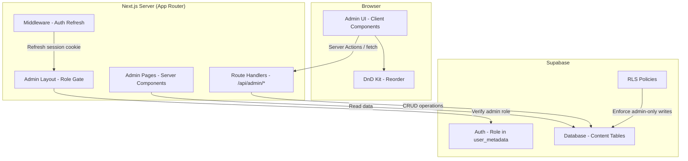

# Design Document: Admin Interface

## Overview

The Admin Interface is a server-rendered, role-gated content management system built within the existing Next.js 16 + Supabase application. It provides administrators with CRUD operations for lessons, exercises, grammar blocks, and placement challenges at the `/admin` route group. The interface uses server-side role verification on every request, a dedicated admin layout with sidebar navigation and breadcrumbs, and real-time content validation to ensure exercises remain consistent with their target sentences.

### Key Design Decisions

1. **Route Group Architecture**: The admin interface lives under `src/app/(admin)/admin/` as a Next.js route group, keeping admin layouts separate from the learner-facing `(protected)` group.
2. **Server-Side Role Verification**: Every admin page and API route verifies the `admin` role via Supabase on the server. No client-side-only gating.
3. **Database-First Content**: Content moves from hardcoded TypeScript files (`learning-path.ts`, `placement-challenges.ts`) to Supabase tables, with the admin interface as the authoring tool.
4. **Reuse Existing Patterns**: Leverages the existing `createSupabaseServerClient`, `@supabase/ssr`, and `@dnd-kit` (already installed) for drag-and-drop reordering.
5. **Content Validation at Save Time**: Block-to-sentence consistency checks run server-side before persisting, surfacing warnings rather than hard-blocking saves for flexibility.

## Architecture



### Request Flow

1. User navigates to `/admin/*`
2. Middleware refreshes the Supabase session cookie
3. Admin layout server component calls `supabase.auth.getUser()` and checks for `admin` role in `user_metadata` or a `user_roles` table
4. If not authenticated → redirect to `/auth/signin?redirect=/admin/...`
5. If authenticated but not admin → render Access Denied page
6. If admin → render admin layout with sidebar, breadcrumbs, and page content
7. Mutations go through Route Handlers (`/api/admin/...`) which re-verify the role before writing

## Components and Interfaces

### Route Structure

```
src/app/(admin)/admin/
├── layout.tsx                    # Admin layout with sidebar + breadcrumb
├── page.tsx                      # Admin dashboard (redirect to /admin/lessons)
├── denied/page.tsx               # Access denied page
├── lessons/
│   ├── page.tsx                  # Lesson list (grouped by level)
│   ├── new/page.tsx              # Create lesson form
│   └── [lessonId]/
│       ├── page.tsx              # Lesson detail (exercise list)
│       ├── edit/page.tsx         # Edit lesson form
│       └── exercises/
│           ├── new/page.tsx      # Create exercise form
│           └── [exerciseId]/
│               ├── page.tsx      # Exercise detail (block list)
│               └── edit/page.tsx # Edit exercise form
├── challenges/
│   ├── page.tsx                  # Placement challenge list
│   └── [challengeId]/
│       ├── edit/page.tsx         # Edit challenge form
│       └── exercises/page.tsx    # Manage challenge exercises
```

### Key Components

| Component | Type | Responsibility |
|-----------|------|---------------|
| `AdminLayout` | Server Component | Role verification, sidebar nav, breadcrumb |
| `AdminSidebar` | Client Component | Navigation links with active state |
| `Breadcrumb` | Server Component | Path-based breadcrumb trail |
| `NotificationStack` | Client Component | Toast notifications (max 5, auto-dismiss) |
| `LessonListView` | Server Component | Fetches and renders lessons grouped by level |
| `LessonForm` | Client Component | Create/edit lesson with validation |
| `ExerciseForm` | Client Component | Create/edit exercise with validation |
| `BlockForm` | Client Component | Create/edit grammar block with validation |
| `ReorderList` | Client Component | Drag-and-drop reorder using `@dnd-kit` |
| `DeleteConfirmDialog` | Client Component | Confirmation modal with item count |
| `ContentValidator` | Utility (shared) | Block-to-sentence consistency check |

### Service Layer

```typescript
// src/lib/services/content-manager.ts
interface ContentManager {
  // Lessons
  getLessons(): Promise<LessonWithCount[]>
  getLessonById(id: string): Promise<LessonDetail>
  createLesson(data: CreateLessonInput): Promise<Lesson>
  updateLesson(id: string, data: UpdateLessonInput): Promise<Lesson>
  deleteLesson(id: string): Promise<void>
  reorderLessons(levelId: string, orderedIds: string[]): Promise<void>

  // Exercises
  getExercisesByLesson(lessonId: string): Promise<ExerciseWithBlockCount[]>
  getExerciseById(id: string): Promise<ExerciseDetail>
  createExercise(lessonId: string, data: CreateExerciseInput): Promise<Exercise>
  updateExercise(id: string, data: UpdateExerciseInput): Promise<Exercise>
  deleteExercise(id: string): Promise<void>
  reorderExercises(lessonId: string, orderedIds: string[]): Promise<void>

  // Grammar Blocks
  getBlocksByExercise(exerciseId: string): Promise<GrammarBlock[]>
  createBlock(exerciseId: string, data: CreateBlockInput): Promise<GrammarBlock>
  updateBlock(id: string, data: UpdateBlockInput): Promise<GrammarBlock>
  deleteBlock(id: string): Promise<void>
  reorderBlocks(exerciseId: string, orderedIds: string[]): Promise<void>

  // Placement Challenges
  getChallenges(): Promise<ChallengeWithCount[]>
  getChallengeById(id: string): Promise<ChallengeDetail>
  updateChallenge(id: string, data: UpdateChallengeInput): Promise<Challenge>
  addExerciseToChallenge(challengeId: string, exerciseId: string): Promise<void>
  removeExerciseFromChallenge(challengeId: string, exerciseId: string): Promise<void>
  reorderChallengeExercises(challengeId: string, orderedIds: string[]): Promise<void>
}
```

### API Route Handlers

All admin API routes follow this pattern:

```typescript
// src/app/api/admin/lessons/route.ts
export async function POST(request: Request) {
  const supabase = await createSupabaseServerClient()
  const { data: { user } } = await supabase.auth.getUser()

  if (!user) {
    return Response.json({ error: 'Unauthenticated' }, { status: 401 })
  }

  const isAdmin = await verifyAdminRole(supabase, user.id)
  if (!isAdmin) {
    return Response.json({ error: 'Insufficient permissions' }, { status: 403 })
  }

  // ... perform operation
}
```

## Data Models

### Database Schema Extensions

The existing schema needs these additions/modifications:

```sql
-- Add role column to users table (or use a separate user_roles table)
ALTER TABLE public.users ADD COLUMN role TEXT DEFAULT 'learner' CHECK (role IN ('learner', 'admin'));

-- Extend lessons table to match admin requirements
ALTER TABLE public.lessons
  ADD COLUMN level TEXT NOT NULL DEFAULT 'beginner' CHECK (level IN ('beginner', 'intermediate', 'advanced')),
  ADD COLUMN icon TEXT DEFAULT '📚',
  ADD COLUMN updated_at TIMESTAMPTZ DEFAULT now();

-- Extend exercises table
ALTER TABLE public.exercises
  ADD COLUMN hint TEXT DEFAULT '',
  ADD COLUMN tutor_explanation TEXT DEFAULT '',
  ADD COLUMN updated_at TIMESTAMPTZ DEFAULT now();

-- Placement challenges table
CREATE TABLE public.placement_challenges (
  id UUID PRIMARY KEY DEFAULT gen_random_uuid(),
  title TEXT NOT NULL,
  description TEXT DEFAULT '',
  from_level TEXT NOT NULL CHECK (from_level IN ('beginner', 'intermediate')),
  to_level TEXT NOT NULL CHECK (to_level IN ('intermediate', 'advanced')),
  required_correct INTEGER NOT NULL CHECK (required_correct >= 1),
  created_at TIMESTAMPTZ DEFAULT now(),
  updated_at TIMESTAMPTZ DEFAULT now()
);

-- Junction table for challenge exercises
CREATE TABLE public.challenge_exercises (
  id UUID PRIMARY KEY DEFAULT gen_random_uuid(),
  challenge_id UUID NOT NULL REFERENCES public.placement_challenges(id) ON DELETE CASCADE,
  exercise_id UUID NOT NULL REFERENCES public.exercises(id) ON DELETE CASCADE,
  order_position INTEGER NOT NULL DEFAULT 1,
  UNIQUE(challenge_id, exercise_id)
);

-- RLS policies for admin-only writes
CREATE POLICY "Admin can manage lessons"
  ON public.lessons FOR ALL
  USING (EXISTS (SELECT 1 FROM public.users WHERE id = auth.uid() AND role = 'admin'));

CREATE POLICY "Everyone can read lessons"
  ON public.lessons FOR SELECT
  USING (true);
```

### TypeScript Types

```typescript
// src/types/admin.ts
export type Level = 'beginner' | 'intermediate' | 'advanced'
export type BlockCategory = 'subject' | 'verb' | 'object' | 'modifier' | 'time' | 'place' | 'contrast'

export interface CreateLessonInput {
  title: string          // max 100 chars, non-empty
  description: string    // max 300 chars
  level: Level
  icon: string           // max 10 chars
}

export interface UpdateLessonInput extends Partial<CreateLessonInput> {}

export interface CreateExerciseInput {
  targetSentence: string      // max 200 chars, non-empty
  hint: string                // max 300 chars
  tutorExplanation: string    // max 500 chars
}

export interface UpdateExerciseInput extends Partial<CreateExerciseInput> {}

export interface CreateBlockInput {
  label: string              // max 50 chars, non-whitespace
  category: BlockCategory
  isDistractor: boolean
}

export interface UpdateBlockInput extends Partial<CreateBlockInput> {}

export interface UpdateChallengeInput {
  title: string              // max 100 chars
  description: string        // max 500 chars
  requiredCorrect: number    // >= 1, <= total exercises
  fromLevel: 'beginner' | 'intermediate'
  toLevel: 'intermediate' | 'advanced'
}

// View types (with computed fields)
export interface LessonWithCount {
  id: string
  title: string
  description: string
  level: Level
  icon: string
  order: number
  exerciseCount: number
}

export interface ExerciseWithBlockCount {
  id: string
  targetSentence: string
  order: number
  blockCount: number
  distractorCount: number
}

export interface ChallengeWithCount {
  id: string
  title: string
  fromLevel: string
  toLevel: string
  requiredCorrect: number
  exerciseCount: number
}
```

### Content Validation Logic

```typescript
// src/lib/validation/content-validator.ts
export interface ValidationResult {
  valid: boolean
  errors: string[]    // Hard errors that prevent save
  warnings: string[]  // Soft warnings (admin can proceed)
}

export function validateExerciseBlocks(
  targetSentence: string,
  blocks: Array<{ label: string; isDistractor: boolean; sourceOrder: number }>
): ValidationResult {
  const errors: string[] = []
  const warnings: string[] = []

  const totalBlocks = blocks.length
  if (totalBlocks < 2 || totalBlocks > 15) {
    errors.push(`Block count must be between 2 and 15 (current: ${totalBlocks})`)
  }

  const nonDistractors = blocks
    .filter(b => !b.isDistractor)
    .sort((a, b) => a.sourceOrder - b.sourceOrder)

  if (nonDistractors.length === 0) {
    errors.push('At least one non-distractor block is required')
  }

  const assembled = nonDistractors.map(b => b.label).join(' ')
  if (assembled !== targetSentence) {
    warnings.push('Block labels do not match the target sentence')
  }

  return { valid: errors.length === 0, errors, warnings }
}
```

## Correctness Properties

*A property is a characteristic or behavior that should hold true across all valid executions of a system — essentially, a formal statement about what the system should do. Properties serve as the bridge between human-readable specifications and machine-verifiable correctness guarantees.*

### Property 1: Reorder produces contiguous sequence

*For any* ordered list of items (lessons within a level, exercises within a lesson, blocks within an exercise, or exercises within a challenge) and any valid move operation (moving item from position `i` to position `j`), the resulting order values SHALL form a contiguous integer sequence starting from 1 with no gaps or duplicates.

**Validates: Requirements 2.6, 3.5, 4.4, 5.5**

### Property 2: Content creation round-trip

*For any* valid content input (lesson, exercise, grammar block, or challenge update), creating or updating the entity and then reading it back SHALL produce data equivalent to the input (all user-provided fields match).

**Validates: Requirements 2.3, 2.5, 3.3, 4.3, 5.3**

### Property 3: Cascade deletion completeness

*For any* parent entity (lesson or exercise) that has child entities (exercises, grammar blocks), deleting the parent SHALL result in all descendant entities being removed — querying for any descendant by ID after deletion SHALL return no results.

**Validates: Requirements 2.8, 3.7**

### Property 4: Text field validation rejects invalid input

*For any* string that is either empty, composed entirely of whitespace, or exceeds the maximum character limit for its field (title: 100, target sentence: 200, block label: 50), the corresponding field validator SHALL reject the input and return an appropriate error message.

**Validates: Requirements 2.9, 3.8, 3.9, 4.6**

### Property 5: Block-to-sentence consistency detection

*For any* target sentence and any set of grammar blocks, the content validator SHALL return a warning if and only if the non-distractor block labels — concatenated with a single space in source_order — do NOT produce a case-sensitive exact match of the target sentence.

**Validates: Requirements 6.1, 6.2**

### Property 6: Block count range validation

*For any* exercise with a total block count (including distractors) outside the range [2, 15], the content validator SHALL return an error preventing the save operation. For any block count within [2, 15], this check SHALL pass.

**Validates: Requirements 6.3, 6.4**

### Property 7: Non-distractor minimum enforcement

*For any* set of grammar blocks within an exercise where all blocks have `isDistractor = true` (zero non-distractor blocks), the content validator SHALL return an error indicating at least one non-distractor block is required.

**Validates: Requirements 4.7**

### Property 8: Level ordering constraint

*For any* placement challenge where `fromLevel` is equal to or at a higher tier than `toLevel` (using the ordering beginner < intermediate < advanced), validation SHALL reject the update with an error indicating that from-level must be strictly lower than to-level.

**Validates: Requirements 5.6**

### Property 9: Required correct count bound

*For any* placement challenge update where `requiredCorrect` exceeds the total number of exercises assigned to that challenge, validation SHALL reject the update. For any `requiredCorrect` value between 1 and total exercises (inclusive), this check SHALL pass.

**Validates: Requirements 5.4**

### Property 10: Deletion re-sequencing

*For any* ordered list of blocks within an exercise and any single deletion at position `k`, the remaining blocks SHALL be re-assigned contiguous source_order values from 1 to (n-1), preserving the relative order of non-deleted items.

**Validates: Requirements 4.5**

### Property 11: Breadcrumb generation from path

*For any* valid admin route path (e.g., `/admin/lessons/[id]/exercises/[id]`), the breadcrumb generator SHALL produce an ordered array of segments where each segment's href is a valid prefix of the full path, and the final segment matches the current page.

**Validates: Requirements 7.2**

## Error Handling

| Scenario | Response | User Experience |
|----------|----------|-----------------|
| Unauthenticated access to `/admin` | Redirect to `/auth/signin?redirect=/admin/...` | Seamless return after login |
| Non-admin access to `/admin` | Render Access Denied page with link to `/dashboard` | Clear message, easy escape |
| Non-admin API request | HTTP 403 `{ error: "Insufficient permissions" }` | Client shows error notification |
| Role verification service unavailable | HTTP 503 + "Service temporarily unavailable" message | Admin knows to retry |
| Session expired mid-use | Next request returns 401, client redirects to sign-in | Preserves intended destination |
| Database write failure | HTTP 500 + error details, client preserves input | Admin can retry without re-entering data |
| Validation error (hard) | HTTP 422 + `{ errors: [...] }`, prevents save | Inline field errors shown |
| Validation warning (soft) | HTTP 200 + `{ warnings: [...] }`, allows proceed | Warning banner, admin decides |
| Concurrent edit conflict | HTTP 409 + `{ error: "Content was modified" }` | Prompt to reload and retry |

### Error Handling Principles

1. **Fail closed**: If role verification fails for any reason, deny access (never grant)
2. **Preserve user work**: On any failure after form submission, keep form state intact
3. **Distinguish hard errors from warnings**: Validation errors block save; warnings inform but allow proceed
4. **Actionable messages**: Every error tells the admin what went wrong and what to do next

## Testing Strategy

### Property-Based Tests (using `fast-check`)

The project already has `fast-check` as a devDependency. Property-based tests will validate the core correctness properties:

- **Content Validator**: Properties 5, 6, 7 (block-to-sentence consistency, block count range, non-distractor minimum)
- **Reorder Logic**: Properties 1, 10 (contiguous sequencing after move/delete)
- **Field Validation**: Property 4 (text field validation rejects invalid inputs)
- **Level Constraint**: Property 8 (from-level < to-level)
- **Bound Constraint**: Property 9 (requiredCorrect <= totalExercises)
- **Breadcrumb Generator**: Property 11 (path → segments correctness)

Configuration: minimum 100 iterations per property test. Each test tagged with:
```
// Feature: admin-interface, Property {N}: {property_text}
```

### Unit Tests (Example-Based)

- Admin layout renders correctly for admin users (Req 1.3)
- Access denied page shows for non-admin users (Req 1.2)
- Redirect to sign-in for unauthenticated users (Req 1.1)
- Form pre-population for edit views (Req 2.4, 3.4)
- Delete confirmation dialogs show correct counts (Req 2.7, 3.6)
- Notification auto-dismiss after 3 seconds (Req 7.3)
- Error notification persists until dismissed (Req 7.4)

### Integration Tests

- Full CRUD cycle for lessons via API routes (create → read → update → delete)
- Role verification on every admin API endpoint (Req 1.4)
- Cascade deletion removes all descendants in database
- Reorder via API correctly updates all affected rows
- Concurrent access handling

### Edge Case Tests

- Service unavailable during role check returns 503 (Req 1.5)
- Last non-distractor block deletion prevented (Req 4.8)
- Database write failure preserves admin input (Req 2.10)
- Notification stack caps at 5 (Req 7.5)

