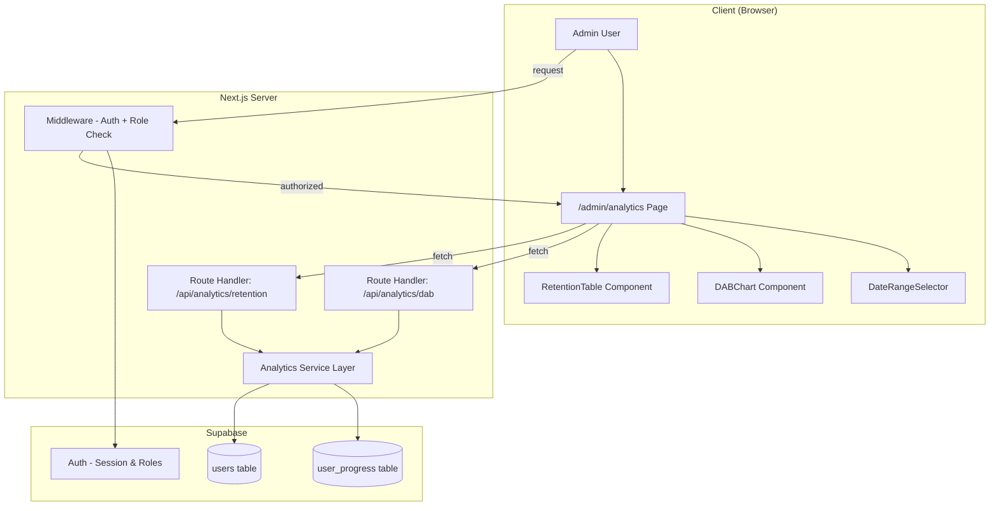

# Design Document: Analytics Dashboard

## Overview

The Analytics Dashboard is an internal admin-only feature that provides two key visualizations for monitoring WordPal platform health: a Daily Active Builders (DAB) line chart and a User Retention Cohort heatmap table. The dashboard is served as a protected Next.js route under `/admin/analytics`, accessible only to users with an `admin` role stored in Supabase. Data is aggregated server-side via Next.js Route Handlers that query the existing `user_progress` table, avoiding any new raw data exposure to the client.

The design leverages the existing project stack: Next.js App Router, Supabase (auth + database), Tailwind CSS, and shadcn/ui components. A lightweight charting library (Recharts) is introduced for the DAB line chart, while the retention table is built with custom Tailwind-styled HTML for full color-intensity control.

## Architecture



### Key Architectural Decisions

1. **Separate admin route group**: The dashboard lives under `src/app/(admin)/admin/analytics/` rather than in the existing `(protected)` group. This enables a dedicated layout with admin-specific middleware checks without affecting the builder-facing experience.

2. **Server-side aggregation**: All DAB counts and retention calculations happen in Route Handlers. The client receives pre-computed JSON — no raw `user_progress` rows are exposed.

3. **Two separate API endpoints**: DAB and retention data are fetched independently. This allows the chart and table to load in parallel and enables independent error handling and caching strategies.

4. **Recharts for charting**: Recharts is a well-maintained React charting library that integrates naturally with React component patterns and supports responsive, accessible SVGs. It avoids the bundle overhead of heavier alternatives like Chart.js.

5. **Role stored in `user_metadata` or a `user_roles` table**: The admin role check uses Supabase's `auth.users` metadata or a dedicated `user_roles` lookup table to determine admin access. This is validated both in middleware (for route protection) and in the Route Handler (for API protection).

## Components and Interfaces

### Page Components

| Component | Path | Responsibility |
|-----------|------|----------------|
| `AnalyticsDashboardPage` | `src/app/(admin)/admin/analytics/page.tsx` | Server Component that verifies admin role and renders the dashboard shell |
| `AdminLayout` | `src/app/(admin)/layout.tsx` | Layout with admin navigation, wraps all admin pages |

### Client Components

| Component | Path | Responsibility |
|-----------|------|----------------|
| `DABChart` | `src/components/analytics/DABChart.tsx` | Renders the Daily Active Builders line chart using Recharts |
| `RetentionTable` | `src/components/analytics/RetentionTable.tsx` | Renders the cohort retention heatmap table |
| `DateRangeSelector` | `src/components/analytics/DateRangeSelector.tsx` | Preset and custom date range picker using shadcn/ui Popover + Calendar |
| `AnalyticsDashboard` | `src/components/analytics/AnalyticsDashboard.tsx` | Client orchestrator that manages state, fetching, and passes data to chart/table |
| `AnalyticsErrorState` | `src/components/analytics/AnalyticsErrorState.tsx` | Error display with retry button and attempt tracking |
| `AnalyticsEmptyState` | `src/components/analytics/AnalyticsEmptyState.tsx` | Empty state messaging when no data exists |

### API Route Handlers

| Endpoint | Path | Method | Responsibility |
|----------|------|--------|----------------|
| `/api/analytics/dab` | `src/app/api/analytics/dab/route.ts` | GET | Returns DAB counts for the given date range |
| `/api/analytics/retention` | `src/app/api/analytics/retention/route.ts` | GET | Returns retention cohort data for the given date range |

### Service Layer

| Module | Path | Responsibility |
|--------|------|----------------|
| `analyticsService` | `src/lib/services/analytics.ts` | Pure functions for DAB and retention computation from raw query results |
| `analyticsQueries` | `src/lib/services/analytics-queries.ts` | Supabase query builders for fetching user_progress data |

### Interfaces

```typescript
// Date range parameters shared across API calls
interface DateRangeParams {
  startDate: string; // ISO 8601 date string (YYYY-MM-DD)
  endDate: string;   // ISO 8601 date string (YYYY-MM-DD)
}

// Single DAB data point
interface DABDataPoint {
  date: string;       // YYYY-MM-DD format (UTC)
  count: number;      // Integer count of unique active builders
}

// DAB API response
interface DABResponse {
  data: DABDataPoint[];
  dateRange: DateRangeParams;
}

// Single retention cohort row
interface RetentionCohort {
  cohortStartDate: string;  // YYYY-MM-DD (Monday of the cohort's founding week)
  cohortSize: number;       // Number of users in the cohort
  retentionRates: (number | null)[]; // Array of retention percentages per subsequent window, null for future windows
}

// Retention API response
interface RetentionResponse {
  cohorts: RetentionCohort[];
  dateRange: DateRangeParams;
  windowCount: number;  // Number of subsequent windows (columns), max 10
}

// API error response
interface AnalyticsErrorResponse {
  error: string;
  code: 'INVALID_DATE_RANGE' | 'RANGE_TOO_LARGE' | 'DATABASE_ERROR' | 'UNAUTHORIZED';
}

// Date range selector preset
type DateRangePreset = '7d' | '30d' | '90d' | 'custom';
```

## Data Models

### Existing Table: `user_progress`

The analytics queries rely on the existing `user_progress` table:

| Column | Type | Used For |
|--------|------|----------|
| `id` | string (UUID) | Primary key |
| `user_id` | string (UUID) | Identifies the builder |
| `exercise_id` | string (UUID) | Identifies the completed exercise |
| `completed` | boolean | Filter: only count completed exercises |
| `completed_at` | string (timestamp) | The UTC timestamp used for DAB and cohort grouping |

### New Table: `user_roles`

A new table to store admin role assignments:

| Column | Type | Constraints | Description |
|--------|------|-------------|-------------|
| `id` | UUID | PK, default gen_random_uuid() | Primary key |
| `user_id` | UUID | FK → auth.users(id), UNIQUE | The user this role applies to |
| `role` | text | NOT NULL, CHECK(role IN ('admin')) | Role identifier |
| `created_at` | timestamptz | default now() | When the role was assigned |

**Index**: `idx_user_roles_user_id` on `user_id` for fast lookup during auth checks.

**RLS Policy**: Only service_role can read/write this table. No client-side access.

### DAB Computation Query (Conceptual)

```sql
SELECT
  DATE(completed_at AT TIME ZONE 'UTC') AS activity_date,
  COUNT(DISTINCT user_id) AS dab_count
FROM user_progress
WHERE completed = true
  AND completed_at >= :start_date
  AND completed_at < :end_date + INTERVAL '1 day'
GROUP BY activity_date
ORDER BY activity_date ASC;
```

### Retention Cohort Computation (Conceptual)

1. **Assign cohorts**: Find each user's first `completed_at` date, compute the Monday of that week → cohort start.
2. **Track activity per window**: For each subsequent 7-day window, check if the user completed at least one exercise.
3. **Calculate rates**: `retained_users_in_window / cohort_size * 100`, rounded to 1 decimal.

```sql
-- Step 1: Assign users to cohorts (first activity week)
WITH user_cohorts AS (
  SELECT
    user_id,
    DATE_TRUNC('week', MIN(completed_at AT TIME ZONE 'UTC'))::date AS cohort_start
  FROM user_progress
  WHERE completed = true
  GROUP BY user_id
),
-- Step 2: Generate weekly windows and check retention
weekly_activity AS (
  SELECT
    uc.cohort_start,
    uc.user_id,
    DATE_TRUNC('week', up.completed_at AT TIME ZONE 'UTC')::date AS activity_week
  FROM user_cohorts uc
  JOIN user_progress up ON up.user_id = uc.user_id
  WHERE up.completed = true
)
-- Step 3: Aggregate into retention rates
SELECT
  cohort_start,
  COUNT(DISTINCT user_id) AS cohort_size,
  (activity_week - cohort_start) / 7 AS window_offset,
  COUNT(DISTINCT user_id) AS retained_users
FROM weekly_activity
GROUP BY cohort_start, window_offset
ORDER BY cohort_start DESC, window_offset ASC;
```

### Retention Color Intensity Mapping

| Range | Level | Tailwind Class (example) |
|-------|-------|--------------------------|
| 0–20% | 1 | `bg-emerald-100 text-emerald-900` |
| 21–40% | 2 | `bg-emerald-200 text-emerald-900` |
| 41–60% | 3 | `bg-emerald-400 text-emerald-900` |
| 61–80% | 4 | `bg-emerald-600 text-white` |
| 81–100% | 5 | `bg-emerald-800 text-white` |

All combinations meet WCAG AA contrast requirements (4.5:1 minimum for normal text).


## Correctness Properties

*A property is a characteristic or behavior that should hold true across all valid executions of a system — essentially, a formal statement about what the system should do. Properties serve as the bridge between human-readable specifications and machine-verifiable correctness guarantees.*

### Property 1: DAB computation completeness

*For any* set of `user_progress` records (with `completed = true`) and any valid date range of N days, the computed DAB output SHALL contain exactly N data points — one per calendar day — where each point's count equals the number of distinct `user_id` values with a `completed_at` timestamp on that UTC day, and days with no completions have a count of zero.

**Validates: Requirements 2.4, 6.1**

### Property 2: DAB range clamping

*For any* requested date range, the DAB output array SHALL contain at most 90 data points. If the input range spans more than 90 days, the output SHALL contain exactly 90 data points representing the most recent 90 days of the range.

**Validates: Requirements 2.6**

### Property 3: Date validation rejects future dates

*For any* date value strictly after the current UTC date, the date range validation function SHALL reject it as invalid. For any date value on or before the current UTC date, the validation function SHALL accept it.

**Validates: Requirements 3.3**

### Property 4: Date validation rejects inverted ranges

*For any* pair of dates (start, end) where start is strictly after end, the date range validation function SHALL reject the pair as invalid. For any pair where start ≤ end, the validation function SHALL accept it (subject to other constraints).

**Validates: Requirements 3.4, 6.5**

### Property 5: Cohort assignment correctness

*For any* set of user completion records, each user SHALL be assigned to exactly one cohort whose start date equals the Monday of the UTC week containing that user's earliest `completed_at` timestamp.

**Validates: Requirements 4.1**

### Property 6: Retention rate calculation

*For any* cohort of size S, the retention rate for window W SHALL equal `round(R / S * 100, 1)` where R is the count of distinct cohort members who completed at least one exercise during window W. For window 0 (the founding week), R always equals S, so the retention rate is always 100.0.

**Validates: Requirements 4.2, 4.7**

### Property 7: Rolling window boundaries

*For any* UTC timestamp, the assigned rolling window SHALL start on a Monday at 00:00:00 UTC and end on the following Sunday at 23:59:59 UTC, and the timestamp SHALL fall within that window's boundaries.

**Validates: Requirements 4.4, 4.5**

### Property 8: Complete weeks only

*For any* selected date range, the set of included rolling windows SHALL contain only windows whose Monday start date is ≥ the range start date AND whose Sunday end date is ≤ the range end date. No partial weeks shall be included.

**Validates: Requirements 4.6**

### Property 9: Retention table bounds

*For any* retention dataset, the output SHALL contain at most 12 cohort rows and at most 10 window columns. Cohorts SHALL be ordered from most recent to oldest.

**Validates: Requirements 5.1**

### Property 10: Color intensity mapping

*For any* retention rate value between 0 and 100 (inclusive), the color intensity function SHALL return exactly one of 5 discrete levels: level 1 for 0–20%, level 2 for 21–40%, level 3 for 41–60%, level 4 for 61–80%, level 5 for 81–100%.

**Validates: Requirements 5.4**

## Error Handling

### API Error Strategy

| Error Scenario | HTTP Status | Client Behavior |
|---------------|-------------|-----------------|
| Unauthenticated request | 401 | Redirect to sign-in |
| Non-admin user | 403 | Display forbidden message |
| Invalid date range (start > end) | 400 | Display validation error inline |
| Date range exceeds 365 days | 400 | Display validation error inline |
| Database query failure | 500 | Display error state with retry |
| API timeout (> 30s) | Client-side timeout | Display timeout error with retry |

### Retry Strategy

- Maximum 3 consecutive retry attempts per fetch operation
- Each retry re-initiates the full data fetch (no incremental retry)
- After 3 failures, retry button is disabled with persistent error message
- Retry counter resets on successful fetch or page navigation

### Error Boundaries

- Each visualization component (DABChart, RetentionTable) has an independent error boundary
- One component failing does not prevent the other from rendering
- The DateRangeSelector remains interactive during error states to allow range adjustment

### Session Expiry

- Middleware intercepts requests with expired sessions and redirects to sign-in
- Client-side: if a fetch returns 401, the dashboard redirects to sign-in preserving the return URL
- No analytics data is cached client-side after session expiry

## Testing Strategy

### Unit Tests (Example-Based)

| Area | Tests |
|------|-------|
| Auth middleware | Redirect for unauthenticated users, 403 for non-admin, pass-through for admin |
| Date range defaults | Default 30-day range, preset calculations |
| API route validation | Invalid params return 400, missing params default correctly |
| Empty/loading states | Skeleton display, empty state messages, error messages |
| Retry logic | Counter increments, max 3 attempts, disabled after exhaustion |
| Tooltip content | Correct format for DAB and retention tooltips |

### Property-Based Tests

Property-based tests use `fast-check` (already in devDependencies) and run a minimum of 100 iterations each.

| Property | Module Under Test | Generator Strategy |
|----------|-------------------|-------------------|
| P1: DAB completeness | `analyticsService.computeDAB()` | Random arrays of `{userId, completedAt}` + random date ranges |
| P2: DAB clamping | `analyticsService.computeDAB()` | Random date ranges with span 1–365 days |
| P3: Future date rejection | `validateDateRange()` | Random dates from past year to +1 year from today |
| P4: Inverted range rejection | `validateDateRange()` | Random date pairs, some inverted |
| P5: Cohort assignment | `analyticsService.assignCohorts()` | Random user completion records across multiple weeks |
| P6: Retention rate | `analyticsService.computeRetention()` | Random cohorts with known activity patterns |
| P7: Window boundaries | `getWindowForDate()` | Random UTC timestamps |
| P8: Complete weeks | `filterCompleteWindows()` | Random date ranges crossing week boundaries |
| P9: Table bounds | `formatRetentionTable()` | Random datasets with 1–50 cohorts |
| P10: Color intensity | `getIntensityLevel()` | Random numbers 0–100 |

Each property test is tagged:
```
// Feature: analytics-dashboard, Property 1: DAB computation completeness
```

### Integration Tests

| Area | Tests |
|------|-------|
| `/api/analytics/dab` | End-to-end with seeded Supabase data, verifying response shape and values |
| `/api/analytics/retention` | End-to-end with seeded cohort data |
| Admin role check | Full request cycle through middleware to API |
| Date range propagation | Selecting a range updates both chart and table |

### Accessibility Testing

- Verify WCAG AA contrast for all 5 retention color intensity levels
- Verify chart has appropriate ARIA labels and roles
- Verify table cells have accessible tooltip triggers (keyboard-navigable)
- Screen reader testing for chart data interpretation
