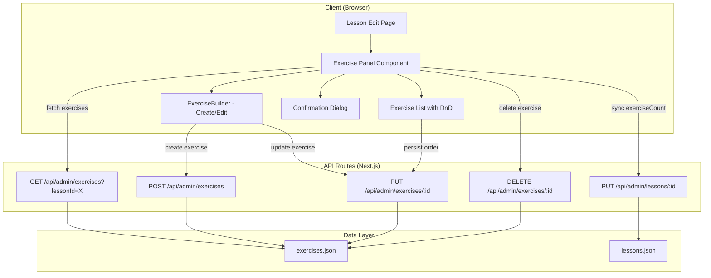

# Design Document: Lesson Activities

## Overview

This feature transforms the lesson editing interface into a full content management hub by integrating exercise (activity) management directly within the lesson editor. Administrators will be able to create, view, edit, reorder, and remove exercises without leaving the lesson context.

The implementation builds on the existing `ExerciseBuilder` component, the JSON-file-based persistence layer, and the established API patterns. It introduces a new Exercises API endpoint, enhances the lesson edit page with a dedicated Exercise Panel, and modifies the lesson creation flow to redirect to the edit page after successful creation.

### Key Design Decisions

1. **Exercises API as a new route** — A dedicated `/api/admin/exercises` endpoint with `lessonId` filtering, plus `/api/admin/exercises/[id]` for individual exercise operations. This follows the existing pattern (lessons, learning-paths, etc.).
2. **Optimistic UI for reorder** — Drag-and-drop reorder updates the visual order immediately, with rollback on failure. This provides a responsive editing experience.
3. **Inline ExerciseBuilder** — The existing component is rendered inline within expandable sections, avoiding page navigation. The type selector is disabled for edits.
4. **Exercise count synchronization** — After every create/delete, a PUT request updates the lesson's `exerciseCount` field, derived from the actual count rather than increment/decrement.
5. **Post-creation redirect** — After creating a new lesson, the user is redirected to the edit page within 2 seconds so they can immediately add exercises.

## Architecture



### Data Flow

1. **Load**: Edit page mounts → Exercise Panel fetches `GET /api/admin/exercises?lessonId={id}` → renders sorted list
2. **Create**: Admin opens ExerciseBuilder → saves → `POST /api/admin/exercises` → appends to list → `PUT /api/admin/lessons/{id}` to sync count
3. **Edit**: Admin clicks edit → ExerciseBuilder opens pre-populated (type disabled) → saves → `PUT /api/admin/exercises/{id}` → updates row in list
4. **Delete**: Admin clicks delete → confirmation dialog → `DELETE /api/admin/exercises/{id}` → removes from list, recalculates order → `PUT /api/admin/lessons/{id}` to sync count
5. **Reorder**: Admin drags exercise → optimistic order update → `PUT /api/admin/exercises/{id}` for each changed exercise → rollback on failure

## Components and Interfaces

### ExercisePanel (New Component)

The main container component for exercise management within the lesson editor.

```typescript
interface ExercisePanelProps {
  lessonId: string;
}

// Internal state
interface ExercisePanelState {
  exercises: AdminExercise[];
  isLoading: boolean;
  error: string | null;
  isCreating: boolean;       // ExerciseBuilder open for creation
  editingId: string | null;  // ID of exercise being edited, null if none
  deleteConfirmId: string | null; // ID of exercise pending deletion
}
```

### ExerciseRow (New Component)

A single exercise item in the list, with drag handle, content preview, and action buttons.

```typescript
interface ExerciseRowProps {
  exercise: AdminExercise;
  index: number;
  showDragHandle: boolean;
  onEdit: (id: string) => void;
  onDelete: (id: string) => void;
  isDeleting: boolean;
}
```

### ConfirmDialog (New Component)

A reusable confirmation dialog for destructive actions.

```typescript
interface ConfirmDialogProps {
  open: boolean;
  title: string;
  message: string;
  confirmLabel: string;
  onConfirm: () => void;
  onCancel: () => void;
  isLoading?: boolean;
}
```

### ExerciseBuilder (Existing — Extended Usage)

The existing `ExerciseBuilder` component is used as-is with the following prop patterns:

- **Create mode**: `initialType` defaults, `onSave` sends POST request
- **Edit mode**: `initialType` set to current type + CSS/attribute to disable type selector, `initialBlocks`/content pre-populated, `onSave` sends PUT request

### API Interfaces

```typescript
// GET /api/admin/exercises?lessonId={id}
// Response: { data: AdminExercise[] }

// POST /api/admin/exercises
interface CreateExerciseBody {
  type: ExerciseType;
  content: AdminExercise['content'];
  lessonId: string;
}
// Response: { data: AdminExercise } (status 201)

// PUT /api/admin/exercises/[id]
interface UpdateExerciseBody {
  content?: AdminExercise['content'];
  order?: number;
  status?: LessonStatus;
}
// Response: { data: AdminExercise }

// DELETE /api/admin/exercises/[id]
// Response: { data: { message: string } }
```

## Data Models

### Exercise Data (exercises.json — New Format)

The existing `exercises.json` stores exercises keyed by ID with minimal structure. This feature migrates it to an array format consistent with other data files:

```typescript
// New exercises.json format: AdminExercise[]
[
  {
    "id": "ex-abc123",
    "lessonId": "les-xyz789",
    "type": "drag-and-drop",
    "order": 1,
    "status": "draft",
    "content": {
      "targetSentence": "The cat sat on the mat",
      "blocks": [...]
    },
    "createdAt": "2025-01-15T10:00:00.000Z",
    "updatedAt": "2025-01-15T10:00:00.000Z"
  }
]
```

### Lesson Data (lessons.json — Existing)

The `exerciseCount` field already exists on `AdminLesson`. This feature ensures it stays synchronized:

```typescript
{
  "id": "les-xyz789",
  "exerciseCount": 3,  // Updated on create/delete
  // ... other fields
}
```

### Exercise Order Invariants

- Order values are contiguous integers starting at 1
- After any create, delete, or reorder operation, all exercises for a lesson must have orders 1..N
- The `order` field determines display sequence (ascending)

## Correctness Properties

*A property is a characteristic or behavior that should hold true across all valid executions of a system — essentially, a formal statement about what the system should do. Properties serve as the bridge between human-readable specifications and machine-verifiable correctness guarantees.*

### Property 1: Filtering by lessonId returns only matching exercises

*For any* set of exercises with various `lessonId` values, filtering by a specific `lessonId` SHALL return exactly and only those exercises whose `lessonId` field matches the provided value, with no matching exercises omitted and no non-matching exercises included.

**Validates: Requirements 1.1, 8.1**

### Property 2: Content preview truncation

*For any* exercise content string, the preview SHALL display the first 60 characters followed by an ellipsis if the original string length exceeds 60, or the full string unchanged if 60 characters or fewer.

**Validates: Requirements 1.2**

### Property 3: Exercise list sort order

*For any* list of exercises returned from the API, the displayed list SHALL be ordered by the `order` field in ascending numeric order.

**Validates: Requirements 1.3**

### Property 4: New exercise order assignment

*For any* lesson with N existing exercises (where 0 ≤ N < 50), a newly created exercise SHALL receive an `order` value of N + 1 and a `status` of "draft".

**Validates: Requirements 2.3**

### Property 5: Order contiguity after mutation

*For any* lesson exercise list, after any delete operation (removing exercise at position P) or any reorder operation (moving exercise from position A to position B), the resulting exercises SHALL have contiguous order values forming the sequence 1, 2, ..., N where N is the number of remaining exercises, preserving the relative order of non-moved items.

**Validates: Requirements 3.4, 4.2**

### Property 6: Cancel preserves state

*For any* exercise list and any exercise within it, opening a delete confirmation or edit form and then cancelling SHALL leave the exercise list and all exercise data identical to their state before the action was initiated.

**Validates: Requirements 3.2, 5.5**

### Property 7: Reorder rollback on failure

*For any* exercise list and any valid reorder operation, if the persistence request fails, the visual order SHALL revert to the exact state that existed before the reorder was initiated (round-trip: reorder then fail equals identity).

**Validates: Requirements 4.4**

### Property 8: Edit does not change order

*For any* exercise in a list, successfully editing its content SHALL not modify its `order` value — the order before and after the edit operation SHALL be identical.

**Validates: Requirements 5.4**

### Property 9: exerciseCount equals actual count

*For any* lesson, after any create or delete operation, the `exerciseCount` value sent to the Lesson API SHALL equal the actual number of exercises whose `lessonId` matches the lesson, derived by counting rather than increment/decrement.

**Validates: Requirements 6.1, 6.2, 6.3**

### Property 10: exerciseCount bounds

*For any* lesson at any point in time, the `exerciseCount` value SHALL be a non-negative integer in the range [0, 999].

**Validates: Requirements 6.5**

## Error Handling

| Scenario | User Feedback | Recovery Action |
|----------|---------------|-----------------|
| Exercise list fetch fails | Error message with retry button | Retry re-triggers fetch |
| Exercise create fails (4xx/5xx) | Error notification (dismissible) | ExerciseBuilder retains field values for retry |
| Exercise delete fails | Error notification | Delete button re-enabled, exercise remains in list |
| Reorder persistence fails | Error notification | Visual order reverts to previous state |
| Exercise edit fails | Error notification | ExerciseBuilder retains unsaved changes |
| exerciseCount sync fails | Error message | Local count retained for retry on next operation |
| Lesson creation fails | Error message on new lesson page | Page stays, admin can correct and retry |
| Empty lessonId query parameter | 400 response from API | Client should never send empty lessonId |

### Error Notification Pattern

All error notifications follow a consistent pattern:
- Displayed as a dismissible toast/banner within the Exercise Panel
- Remain visible until the admin explicitly dismisses them
- Do not block other interactions in the panel
- Include the type of failed operation in the message text

### Optimistic UI Rollback Strategy

For reorder operations, the component maintains a snapshot of the previous exercise list before applying the optimistic update. On failure:
1. Restore the snapshot as the current state
2. Show error notification
3. No further automatic retry (admin can re-drag)

## Testing Strategy

### Property-Based Tests (fast-check + vitest)

Property-based testing applies to this feature because:
- The core logic involves pure data transformations (filtering, ordering, truncation, counting)
- Properties are universal across all valid inputs (any exercise type, any content length, any list size)
- The input space is large (content strings, list permutations, order values)

**Library**: `fast-check` (already in devDependencies)
**Framework**: `vitest` (already configured)
**Iterations**: Minimum 100 per property test

Each property test must reference its design document property with the tag format:
`Feature: lesson-activities, Property {number}: {property_text}`

**Properties to implement:**
1. Filter by lessonId correctness
2. Content preview truncation logic
3. Sort order invariant
4. New exercise order assignment
5. Order contiguity after delete/reorder
6. Cancel state preservation
7. Reorder rollback (round-trip)
8. Edit preserves order
9. exerciseCount derivation
10. exerciseCount bounds

### Unit Tests (vitest)

Unit tests cover specific examples, edge cases, and integration points:

- Loading skeleton renders at least 3 placeholder rows
- Empty state renders correct message
- Error state renders retry button that re-triggers fetch
- Add Exercise button disabled at 50 exercises
- ExerciseBuilder opens in create mode on button click
- ExerciseBuilder opens in edit mode with type selector disabled
- Confirmation dialog shows exercise type and order number
- Drag handles hidden when < 2 exercises
- POST request body structure validation
- PUT request targets correct endpoint
- DELETE request targets correct endpoint
- Post-creation redirect to edit page within 2 seconds
- Empty string lessonId returns 400
- Non-matching lessonId returns empty array with 200

### Integration Tests

Integration tests verify the full flow through API routes:

- Create exercise → verify it appears in GET response with correct lessonId
- Delete exercise → verify it no longer appears in GET response
- Update exercise order → verify GET returns exercises in new order
- Lesson exerciseCount sync after create/delete
- New lesson creation → redirect → empty exercise list

