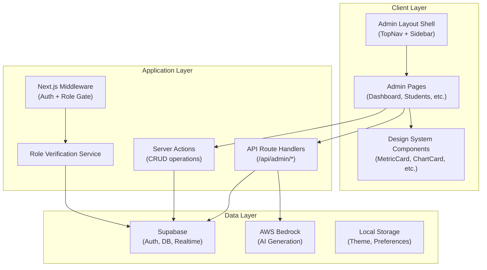
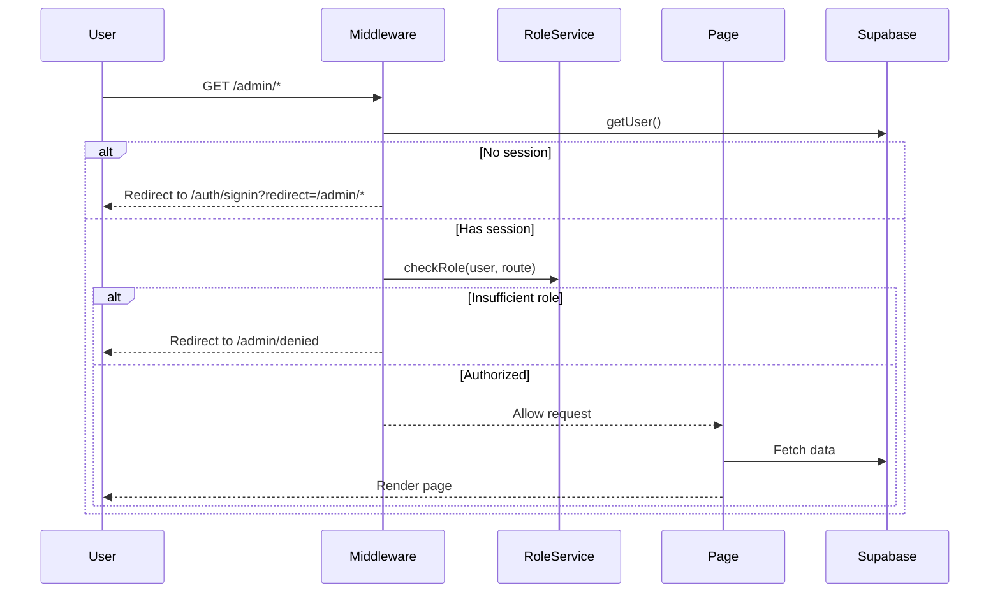
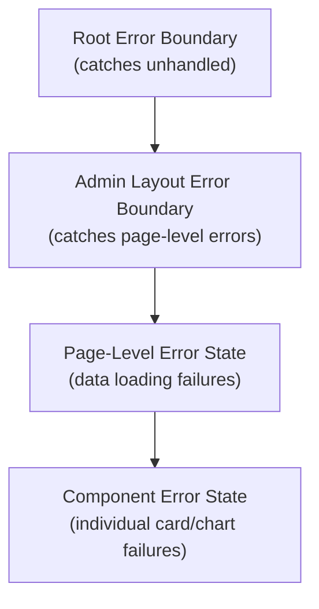

# Design Document: WordPal Admin Dashboard

## Overview

The WordPal Admin Dashboard is a premium management interface built as a Next.js App Router application within the existing WordPal platform. It provides administrators, instructors, and content creators with a desktop-first responsive dashboard to manage students, learning paths, lessons, exercises, AI-generated content, placement challenges, analytics, and platform settings.

The dashboard leverages the existing Supabase authentication infrastructure (AuthContext, middleware) and extends it with role-based access control. It introduces a comprehensive design system of reusable components, integrates with AWS Bedrock for AI content generation, and uses Recharts for analytics visualizations.

**Key Design Decisions:**
- **Desktop-first responsive layout** with graceful tablet degradation (sidebar collapse at <1024px)
- **Role-based access** enforced at both middleware (server-side) and component (client-side) levels
- **Supabase as the backend** for data persistence, auth, and real-time notifications
- **AWS Bedrock** (already a dependency) for AI content generation
- **Recharts** for chart rendering in the analytics dashboard
- **Design system approach** with independently importable, prop-driven components
- **Next.js App Router** route groups for admin layout isolation

## Architecture



### Route Structure

```
src/app/(admin)/admin/
├── layout.tsx                 # Admin shell (TopNav + Sidebar)
├── page.tsx                   # Dashboard Overview (KPIs)
├── students/
│   ├── page.tsx              # Student list with table
│   └── [id]/page.tsx        # Student profile view
├── learning-paths/
│   ├── page.tsx              # Learning path list
│   ├── new/page.tsx          # Create learning path
│   └── [id]/edit/page.tsx    # Edit learning path
├── lessons/
│   ├── page.tsx              # Lesson list
│   ├── new/page.tsx          # Lesson builder
│   └── [id]/edit/page.tsx    # Edit lesson
├── exercises/
│   ├── page.tsx              # Exercise list
│   ├── new/page.tsx          # Exercise builder
│   └── [id]/edit/page.tsx    # Edit exercise
├── ai-studio/
│   └── page.tsx              # AI Content Studio
├── challenges/
│   ├── page.tsx              # Placement challenge list
│   ├── new/page.tsx          # Create challenge
│   └── [id]/edit/page.tsx    # Edit challenge
├── analytics/
│   └── page.tsx              # Analytics dashboard + AI insights
├── achievements/
│   ├── page.tsx              # Achievement list
│   └── new/page.tsx          # Create achievement
├── settings/
│   └── page.tsx              # Platform settings
├── denied/
│   └── page.tsx              # Access denied page
└── notifications/
    └── page.tsx              # Full notification history
```

### Request Flow



## Components and Interfaces

### Admin Layout Components

```typescript
// src/components/admin/AdminLayout.tsx
interface AdminLayoutProps {
  children: React.ReactNode;
}

// src/components/admin/TopNav.tsx
interface TopNavProps {
  user: AdminUser;
  notificationCount: number;
  onSearch: (query: string) => void;
  onThemeToggle: () => void;
  isDarkMode: boolean;
}

// src/components/admin/Sidebar.tsx
interface SidebarProps {
  currentPath: string;
  userRole: UserRole;
  isCollapsed: boolean;
  onToggleCollapse: () => void;
}

interface NavItem {
  label: string;
  href: string;
  icon: React.ReactNode;
  requiredRoles: UserRole[];
}
```

### Design System Components

```typescript
// src/components/admin/design-system/MetricCard.tsx
interface MetricCardProps {
  title: string;            // max 50 chars
  value: string | number;
  changePercentage: number; // -100 to 9999
  trendDirection: 'up' | 'down';
  icon: React.ReactNode;
  loading?: boolean;
  error?: boolean;
  onRetry?: () => void;
}

// src/components/admin/design-system/ChartCard.tsx
interface ChartCardProps {
  title: string;            // max 80 chars
  chartType: 'line' | 'bar' | 'pie' | 'area' | 'heatmap';
  data: ChartDataPoint[];   // 1 to 1000 points
  dateRange?: DateRange;
  loading?: boolean;
  emptyMessage?: string;
}

// src/components/admin/design-system/StudentTable.tsx
interface StudentTableProps {
  students: StudentRow[];
  columns: ColumnConfig[];
  sortState: SortState;
  filterState: FilterState;
  pagination: PaginationState;
  onSort: (column: string, direction: 'asc' | 'desc') => void;
  onFilter: (filters: FilterState) => void;
  onPageChange: (page: number) => void;
  onRowClick: (studentId: string) => void;
  loading?: boolean;
}

// src/components/admin/design-system/DashboardCard.tsx
interface DashboardCardProps {
  title?: string;
  children: React.ReactNode;
  loading?: boolean;
  className?: string;
}

// src/components/admin/design-system/GrammarRadar.tsx
interface GrammarRadarProps {
  data: { category: BlockCategory; score: number }[];
  size?: number;
}

// src/components/admin/design-system/Timeline.tsx
interface TimelineProps {
  events: TimelineEvent[];
  maxItems?: number;
  pagination?: PaginationState;
}

// src/components/admin/design-system/AIInsightCard.tsx
interface AIInsightCardProps {
  title: string;
  description: string;
  affectedCount: number;
  priority: 'high' | 'medium' | 'low';
  suggestedAction: string;
  onTakeAction: () => void;
}

// src/components/admin/design-system/SearchBar.tsx
interface SearchBarProps {
  placeholder?: string;
  maxLength?: number;       // default 100
  onSearch: (query: string) => void;
  debounceMs?: number;      // default 300
}

// src/components/admin/design-system/FilterPanel.tsx
interface FilterPanelProps {
  filters: FilterConfig[];
  activeFilters: Record<string, unknown>;
  onFilterChange: (key: string, value: unknown) => void;
  onClearAll: () => void;
}

// src/components/admin/design-system/NotificationCenter.tsx
interface NotificationCenterProps {
  notifications: Notification[];
  unreadCount: number;
  onMarkRead: (id: string) => void;
  onMarkAllRead: () => void;
  onClick: (notification: Notification) => void;
  loading?: boolean;
  error?: boolean;
}
```

### Exercise Builder Components

```typescript
// src/components/admin/exercise-builder/ExerciseBuilder.tsx
interface ExerciseBuilderProps {
  exerciseType: ExerciseType;
  initialData?: ExerciseFormData;
  onSave: (data: ExerciseFormData) => Promise<void>;
  onPreview: () => void;
}

type ExerciseType = 
  | 'drag-and-drop'
  | 'multiple-choice'
  | 'sentence-ordering'
  | 'fill-in-blank'
  | 'rewrite-sentence'
  | 'free-writing';

// src/components/admin/exercise-builder/GrammarBlockEditor.tsx
interface GrammarBlockEditorProps {
  blocks: GrammarBlock[];
  onChange: (blocks: GrammarBlock[]) => void;
  minBlocks?: number;       // default 2
  maxBlocks?: number;       // default 15
}
```

### AI Content Studio Components

```typescript
// src/components/admin/ai-studio/AIGenerationForm.tsx
interface AIGenerationFormProps {
  onGenerate: (params: AIGenerationParams) => Promise<void>;
  loading?: boolean;
}

interface AIGenerationParams {
  grammarTopic: string;     // max 100 chars
  targetLevel: CEFRLevel;
  difficulty: 1 | 2 | 3 | 4 | 5;
  learningGoal: string;     // max 300 chars
  context: 'Business' | 'Travel' | 'Daily Life' | 'Interview';
}

// src/components/admin/ai-studio/GeneratedContent.tsx
interface GeneratedContentProps {
  content: AIGeneratedContent;
  onEdit: (section: string, value: unknown) => void;
  onSaveToLesson: () => Promise<void>;
  saving?: boolean;
}
```

## Data Models

### Extended Database Schema

```typescript
// Extended types for admin dashboard (additions to existing Database type)

type UserRole = 'admin' | 'instructor' | 'content_creator' | 'student';
type CEFRLevel = 'A1' | 'A2' | 'B1' | 'B2' | 'C1' | 'C2';
type LearningPathStatus = 'draft' | 'published';
type LessonStatus = 'draft' | 'published' | 'incomplete';
type ExerciseType = 'drag-and-drop' | 'multiple-choice' | 'sentence-ordering' | 'fill-in-blank' | 'rewrite-sentence' | 'free-writing';

// User profiles with role extension
interface AdminUser {
  id: string;
  email: string;
  displayName: string;
  role: UserRole;
  avatarUrl: string | null;
  cefrLevel: CEFRLevel;
  status: 'active' | 'inactive' | 'suspended';
  currentLessonId: string | null;
  currentLearningPathId: string | null;
  grammarScore: number;       // 0-100
  progressPercentage: number; // 0-100
  joinedAt: string;
  lastActiveAt: string;
}

// Learning Path
interface LearningPath {
  id: string;
  title: string;              // max 150 chars
  description: string;        // max 500 chars
  targetLevel: CEFRLevel;
  estimatedDuration: number;  // minutes, 1-9999
  difficulty: 'Beginner' | 'Intermediate' | 'Advanced';
  xpReward: number;           // 1-10000
  status: LearningPathStatus;
  unitCount: number;
  lessonCount: number;
  createdAt: string;
  updatedAt: string;
  createdBy: string;
}

// Unit within a Learning Path
interface Unit {
  id: string;
  learningPathId: string;
  title: string;
  description: string;
  order: number;
  lessonCount: number;
}

// Extended Lesson for admin
interface AdminLesson {
  id: string;
  unitId: string;
  title: string;              // max 150 chars
  description: string;        // max 500 chars
  grammarFocus: string;       // max 100 chars
  cefrLevel: CEFRLevel;
  difficulty: 1 | 2 | 3 | 4 | 5;
  estimatedDuration: number;  // minutes, max 180
  learningObjectives: string[]; // max 10 items, each max 200 chars
  exerciseCount: number;
  status: LessonStatus;
  order: number;
  createdAt: string;
  updatedAt: string;
}

// Extended Exercise for admin builder
interface AdminExercise {
  id: string;
  lessonId: string;
  type: ExerciseType;
  order: number;
  status: LessonStatus;
  // Type-specific content stored as JSONB
  content: DragDropContent | MultipleChoiceContent | SentenceOrderingContent | FillInBlankContent | RewriteSentenceContent | FreeWritingContent;
  createdAt: string;
  updatedAt: string;
}

interface DragDropContent {
  targetSentence: string;
  blocks: GrammarBlock[];
}

interface MultipleChoiceContent {
  question: string;           // 1-300 chars
  options: string[];          // 4 options, 1-200 chars each
  correctIndex: number;       // 0-3
  explanation?: string;       // max 500 chars
}

interface SentenceOrderingContent {
  fragments: string[];        // 2-12 items, 1-200 chars each
}

interface FillInBlankContent {
  sentence: string;           // max 500 chars, ___ as markers
  answers: string[];          // 1-10, each 1-200 chars
}

interface RewriteSentenceContent {
  originalSentence: string;   // 1-300 chars
  instruction: string;        // 1-300 chars
  acceptableAnswers: string[]; // 1-5, each 1-300 chars
}

interface FreeWritingContent {
  prompt: string;             // 1-500 chars
  minWords?: number;          // at least 1
  maxWords?: number;          // up to 1000
  evaluationGuidelines?: string; // max 500 chars
}

// Placement Challenge
interface AdminPlacementChallenge {
  id: string;
  title: string;              // max 150 chars
  targetLevel: CEFRLevel;
  grammarTopics: string[];
  difficulty: 1 | 2 | 3 | 4 | 5;
  exerciseTypes: ExerciseType[];
  questionCount: number;      // 5-50
  status: LearningPathStatus;
  questions: AdminExercise[];
  createdAt: string;
  updatedAt: string;
}

// Achievement
interface Achievement {
  id: string;
  title: string;              // max 100 chars
  description: string;        // max 300 chars
  badgeIcon: string;          // URL or emoji
  xpReward: number;           // 1-10000
  triggerCriteria: 'lessons_completed' | 'streak_days' | 'grammar_score' | 'challenge_passed' | 'exercises_completed';
  thresholdValue: number;
  unlockCount: number;
  createdAt: string;
}

// Analytics types
interface KPIMetric {
  id: string;
  title: string;
  value: number | string;
  changePercentage: number;
  trendDirection: 'up' | 'down';
  period: string;
}

interface ChartDataPoint {
  label: string;
  value: number;
  date?: string;
  category?: string;
}

// Notification
interface AdminNotification {
  id: string;
  type: 'registration' | 'challenge_completion' | 'ai_generation' | 'system_error' | 'ai_insight';
  title: string;
  description: string;        // max 120 chars
  isRead: boolean;
  contextUrl: string;
  createdAt: string;
}

// AI Insight
interface AIInsight {
  id: string;
  title: string;              // max 100 chars
  description: string;        // max 300 chars
  affectedStudentCount: number;
  priority: 'high' | 'medium' | 'low';
  suggestedAction: string;
  actionType: 'content_gap' | 'student_performance';
  actionParams: Record<string, string>;
  generatedAt: string;
}

// Platform Settings
interface PlatformSettings {
  brand: {
    logoUrl: string | null;
    themeColors: { primary: string; secondary: string; accent: string };
    language: string;
  };
  aiModel: string;
  scoring: {
    xpPerExercise: number;      // 1-1000
    xpPerLesson: number;        // 1-10000
    weightByExerciseType: Record<ExerciseType, number>; // percentages sum to 100
    passingThreshold: number;   // 50-100
  };
  notifications: {
    emailEnabled: boolean;
    pushEnabled: boolean;
    digestFrequency: 'daily' | 'weekly' | 'never';
  };
}
```

### Role Permission Matrix

| Section | Administrator | Instructor | Content Creator | Student |
|---------|:---:|:---:|:---:|:---:|
| Dashboard Overview | ✅ | ✅ | ✅ | ❌ |
| Students | ✅ | ✅ | ❌ | ❌ |
| Learning Paths | ✅ | ✅ | ✅ | ❌ |
| Units | ✅ | ✅ | ✅ | ❌ |
| Lessons | ✅ | ✅ | ✅ | ❌ |
| Exercises | ✅ | ✅ | ✅ | ❌ |
| AI Content Studio | ✅ | ✅ | ✅ | ❌ |
| Challenges | ✅ | ✅ | ❌ | ❌ |
| Analytics | ✅ | ✅ | ❌ | ❌ |
| Achievements | ✅ | ✅ | ❌ | ❌ |
| Settings | ✅ | ❌ | ❌ | ❌ |
| Profile | ✅ | ✅ | ✅ | ❌ |


## Correctness Properties

*A property is a characteristic or behavior that should hold true across all valid executions of a system — essentially, a formal statement about what the system should do. Properties serve as the bridge between human-readable specifications and machine-verifiable correctness guarantees.*

### Property 1: Breadcrumb generation respects maximum depth

*For any* valid admin route path (e.g., `/admin/learning-paths/[id]/edit`), the breadcrumb generator should produce a navigation trail reflecting the route hierarchy with a maximum depth of 5 levels, where each breadcrumb segment corresponds to a navigable route ancestor.

**Validates: Requirements 1.3**

### Property 2: Role permission resolution returns correct section set

*For any* user role (Administrator, Instructor, Content_Creator, Student), the permission resolver function should return exactly the set of permitted admin sections as defined in the role permission matrix — no more, no fewer.

**Validates: Requirements 2.1, 2.4, 2.5, 2.6**

### Property 3: API route role enforcement returns 403 for unauthorized access

*For any* combination of user role and admin API route, if the user's role does not include the route's section in its permitted set, the API handler should return HTTP 403 with a JSON error body containing an insufficient permissions message.

**Validates: Requirements 2.7**

### Property 4: MetricCard renders value with correctly rounded percentage and trend indicator

*For any* valid MetricCard props (title ≤50 characters, numeric or string value, change percentage between -100 and 9999, trend direction up/down), the component should render the value as provided, the percentage rounded to exactly one decimal place, the trend arrow matching the direction, and color-code using green for positive and red for negative trends meeting WCAG AA contrast.

**Validates: Requirements 3.2, 18.3**

### Property 5: Timestamp formatting switches between relative and absolute

*For any* event timestamp, if the event occurred within the last 7 days the formatter should produce a relative time string (e.g., "5 minutes ago", "2 hours ago"), and if the event is older than 7 days it should produce an absolute date string.

**Validates: Requirements 3.3**

### Property 6: Student search filters by case-insensitive substring

*For any* search query string and student list, the filter function should return only students whose name or email contains the query as a case-insensitive substring match, and should return the full list when the query is empty.

**Validates: Requirements 4.2**

### Property 7: Student list sorting produces correctly ordered results

*For any* student list and sort configuration (column: Progress/Grammar Score/Last Activity, direction: ascending/descending), the resulting list should be ordered such that each consecutive pair of elements satisfies the sort comparison for the specified column and direction.

**Validates: Requirements 4.4**

### Property 8: Multiple filters combine with AND logic

*For any* combination of active filter criteria (Role, CEFR Level, Learning Path, Status, Date Joined range) and student list, the filtered result should contain only students that satisfy every active filter simultaneously — the intersection of all individual filter results.

**Validates: Requirements 4.5**

### Property 9: Learning Path publish validation enforces content presence

*For any* Learning Path state, the publish validation function should return success if and only if the path contains at least one Unit and that Unit contains at least one Lesson. All other states should return a failure with an error message identifying the specific missing content.

**Validates: Requirements 6.4, 6.5**

### Property 10: Learning Path form validation enforces field constraints

*For any* Learning Path form submission, the validator should reject the submission if the title is empty or exceeds 150 characters, the description exceeds 500 characters, the estimated duration is outside the range 1–9999, or the XP reward is outside the range 1–10000. Each invalid field should produce a specific validation error.

**Validates: Requirements 6.7, 6.8**

### Property 11: Lesson duplication produces correctly transformed title

*For any* lesson title string, the duplicate operation should produce a new title equal to "Copy of " prepended to the original, truncated to 150 characters if the result would exceed that length, and set the duplicated lesson's status to Draft.

**Validates: Requirements 7.4**

### Property 12: Lesson publish validation enforces completeness

*For any* lesson state, the publish validation function should return success if and only if the lesson has at least one exercise and the Title, CEFR Level, Difficulty, and Estimated Duration fields are all non-empty/valid. Failures should identify each missing or invalid field.

**Validates: Requirements 7.5**

### Property 13: Fill-in-blank marker parsing identifies correct blank count

*For any* sentence string, the blank marker parser should identify the number of `___` (three consecutive underscore) occurrences and require exactly that many corresponding answer fields. Valid sentences must contain between 1 and 10 blank markers.

**Validates: Requirements 8.4**

### Property 14: Exercise type-specific validation prevents invalid submissions

*For any* exercise type and its content data, the validator should reject: Multiple Choice without a designated correct answer, Drag-and-Drop Sentence with no non-distractor blocks, Fill-in-Blank with no blank markers, Sentence Ordering with fewer than 2 fragments, and Rewrite Sentence with no acceptable answers. Each rejection should indicate the specific validation failure.

**Validates: Requirements 8.9**

### Property 15: AI generation form required field validation preserves filled fields

*For any* AI content generation form submission where at least one required field is empty, the validator should produce field-level errors indicating which fields are required, without clearing or modifying already-filled field values.

**Validates: Requirements 9.7**

### Property 16: Placement Challenge publish validation enforces question completeness

*For any* Placement Challenge state, the publish validation function should return success if and only if the challenge contains at least the configured number of questions and every question has a designated correct answer. Failures should identify specific questions lacking correct answers or that the count is below minimum.

**Validates: Requirements 10.6, 10.7**

### Property 17: AI insight generation triggers when threshold exceeded

*For any* set of student performance data at a CEFR level with at least 10 students, if more than 30 percent of students score below 60 percent on a specific grammar topic over the most recent 7-day period, the insight generator should produce a recommendation for additional content on that topic.

**Validates: Requirements 12.2**

### Property 18: AI insights sorted by priority based on affected count

*For any* set of AI insights, the display order should sort them by priority where insights affecting more than 50 students are classified as high priority, 21–50 as medium, and 1–20 as low, with high appearing before medium and medium before low.

**Validates: Requirements 12.3**

### Property 19: No insights generated below minimum student threshold

*For any* CEFR level with fewer than 10 students with activity data, the insight generation engine should produce zero insights for that level regardless of score distributions.

**Validates: Requirements 12.7**

### Property 20: Achievement form validation enforces required fields

*For any* achievement form submission, the validator should reject if the title is empty, no trigger criteria is selected, or no threshold value is specified, displaying inline validation errors adjacent to the invalid fields.

**Validates: Requirements 13.5**

### Property 21: Settings form validation enforces range constraints

*For any* settings form submission, the validator should reject values where XP per exercise is outside 1–1000, XP per lesson is outside 1–10000, exercise type weights don't sum to 100, or passing threshold is outside 50–100, displaying inline errors for each invalid field.

**Validates: Requirements 14.6**

### Property 22: Notification badge displays count with 99+ cap

*For any* unread notification count (non-negative integer), the badge should display the exact count for values 1 through 99, display "99+" for values exceeding 99, and be hidden when the count is zero.

**Validates: Requirements 15.1, 1.1**

### Property 23: Global search returns categorized results limited to 5 per category

*For any* search query of at least 2 characters and a dataset of searchable entities, the search function should return results grouped by category (Students, Learning Paths, Lessons, Exercises, Challenges) with a maximum of 5 results per category, and include a "View All" indicator for categories where more results exist.

**Validates: Requirements 16.2, 16.3**

### Property 24: Design system components handle empty data without errors

*For any* design system component receiving an empty data array or undefined optional props, the component should render an empty state with a placeholder message indicating no data is available, without throwing runtime errors or producing an unhandled exception.

**Validates: Requirements 18.6**

## Error Handling

### Error Handling Strategy

| Error Category | Behavior | User Experience |
|---|---|---|
| **Authentication failure** | Redirect to `/auth/signin` with redirect param | Clear sign-in form with message |
| **Authorization failure** | Redirect to `/admin/denied` | Access Denied page with link back |
| **Role service unavailable** | Return HTTP 503 | "Service temporarily unavailable" message |
| **API route unauthorized** | Return HTTP 403 JSON | JSON error with insufficient permissions |
| **Data fetch timeout** | Component-level error state | Error card with retry button |
| **AI generation timeout (30s)** | Show error, preserve form | Error message + Retry button |
| **AI generation failure** | Show error, preserve form | Descriptive error + Retry button |
| **Form validation failure** | Prevent submission | Inline field-level error messages |
| **Save operation failure** | Preserve user input | Error notification + retry action |
| **Network error** | Component-level error boundary | "Reload" button in error boundary |
| **Notification service down** | Degrade gracefully | Bell icon without badge, unavailable message |
| **Analytics data insufficient** | Show empty chart state | "More data needed" message |

### Error Boundary Architecture



### Error Recovery Patterns

1. **Retry with preserved state**: All forms preserve user input on failure. Retry buttons resubmit with the same parameters.
2. **Graceful degradation**: Individual KPI cards, charts, and notifications can fail independently without taking down the page.
3. **Timeout handling**: AI operations have 30-second timeouts; analytics have 10-second timeouts; role verification has 5-second timeout.
4. **Unsaved changes protection**: Settings and form pages warn users before navigation with unsaved changes.

## Testing Strategy

### Unit Tests (Example-Based)

Unit tests will cover specific rendering scenarios, UI interactions, and integration points:

- **Layout rendering**: TopNav, Sidebar, AdminLayout at various viewports
- **Component rendering**: Each design system component with various prop combinations
- **Navigation**: Route changes, breadcrumb updates, active state highlighting
- **Form interactions**: Field changes, submission, validation display
- **Error states**: Error boundaries, retry buttons, timeout displays
- **Accessibility**: ARIA labels, keyboard navigation, focus management

### Property-Based Tests

Property-based testing using `fast-check` (already a dev dependency) will verify universal correctness properties:

**Configuration:**
- Library: `fast-check` v4.9.0 (already installed)
- Minimum iterations: 100 per property
- Each test tagged with: `Feature: wordpal-admin-dashboard, Property {N}: {title}`

**Properties to implement as PBT:**
1. Breadcrumb generation (pure function, route input → breadcrumb array)
2. Role permission resolution (pure function, role → section set)
3. API route role enforcement (with mocked handler, role + route → response code)
4. MetricCard rendering (component with generated props → correct output)
5. Timestamp formatting (pure function, date → formatted string)
6. Student search filtering (pure function, query + list → filtered list)
7. Student list sorting (pure function, list + sort config → sorted list)
8. Filter AND composition (pure function, filters + list → filtered list)
9. Learning Path publish validation (pure function, path state → result)
10. Learning Path form validation (pure function, form data → errors)
11. Lesson duplicate title transformation (pure function, title → transformed title)
12. Lesson publish validation (pure function, lesson state → result)
13. Fill-in-blank marker parsing (pure function, sentence → blank count)
14. Exercise type-specific validation (pure function, type + content → result)
15. AI form required field validation (pure function, form state → errors preserving values)
16. Challenge publish validation (pure function, challenge state → result)
17. Insight generation threshold (pure function, scores → insight decision)
18. Insight priority sorting (pure function, insights → sorted list)
19. Minimum student threshold guard (pure function, student count → boolean)
20. Achievement form validation (pure function, form data → errors)
21. Settings form validation (pure function, settings data → errors)
22. Notification badge cap (pure function, count → display string)
23. Global search categorized limited results (pure function, query + data → grouped results)
24. Design system component empty data resilience (component rendering with empty props)

### Integration Tests

Integration tests for operations requiring external services:

- Supabase data operations (CRUD for learning paths, lessons, exercises)
- AI content generation via AWS Bedrock
- Real-time notification delivery
- Role assignment on user registration
- Settings persistence and platform-wide application

### Accessibility Testing

- Automated axe-core audit for WCAG 2.1 AA violations
- Manual testing with screen readers for complex components (GrammarRadar, Timeline, Heatmap)
- Keyboard navigation flow verification for all interactive elements

