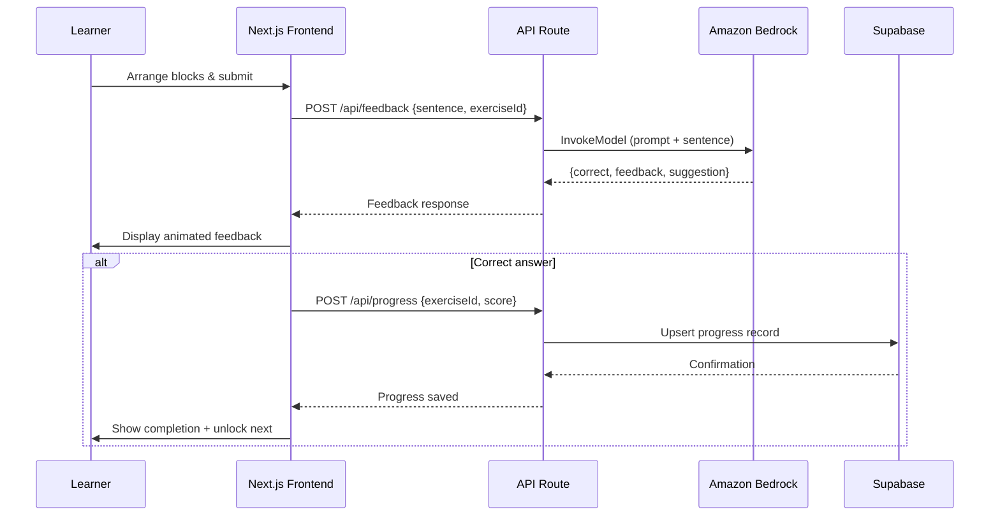
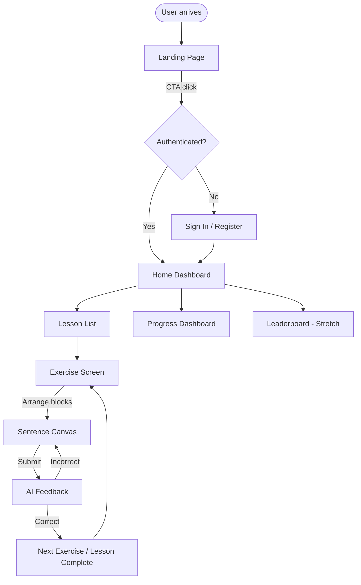
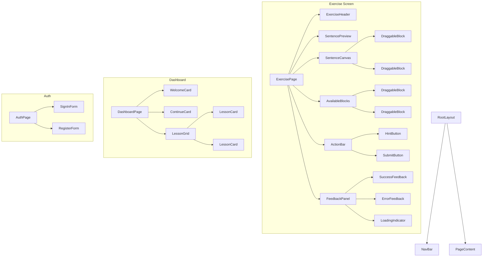
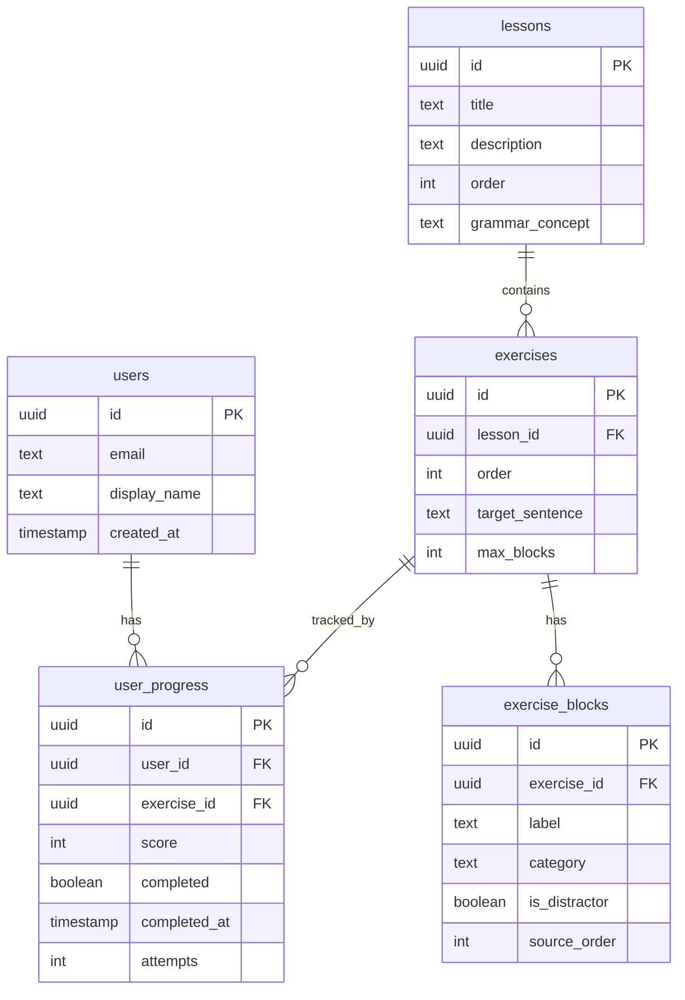
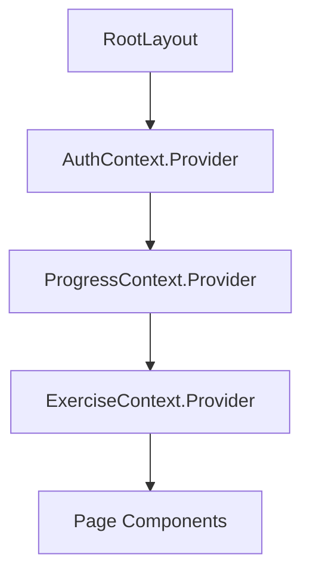
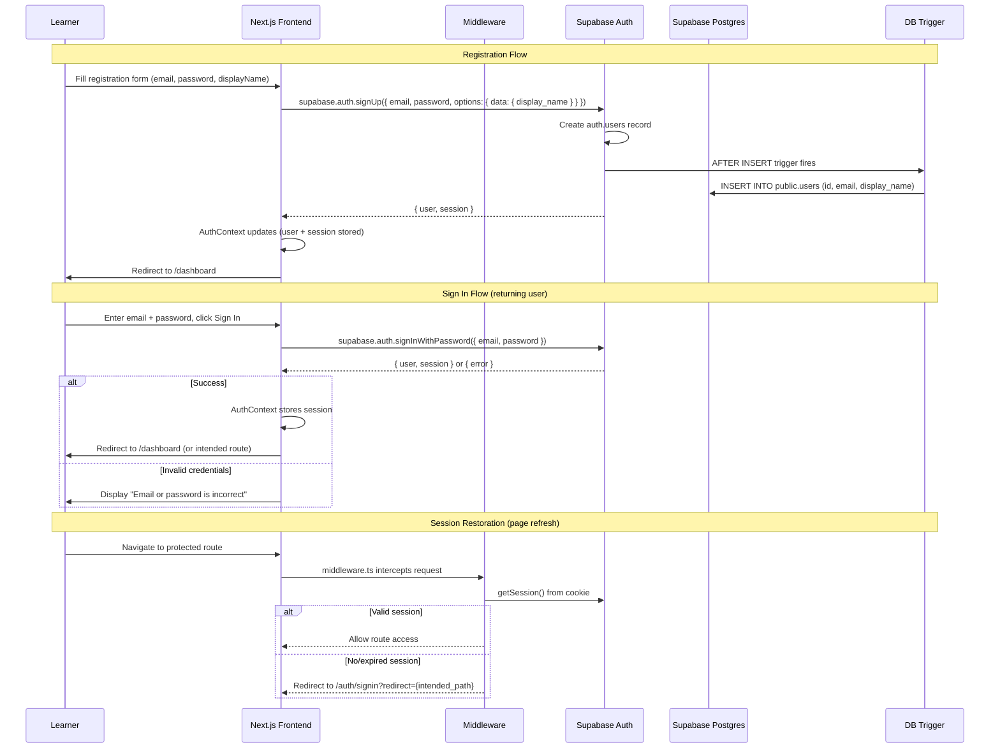
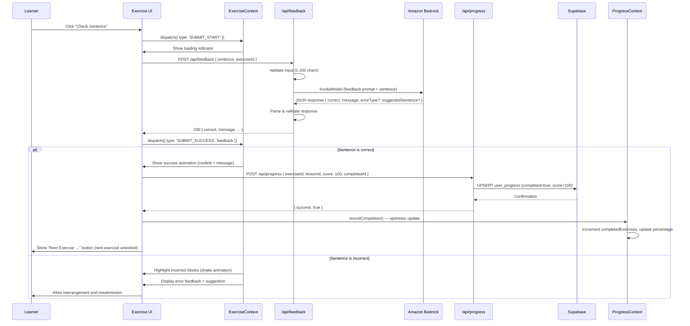
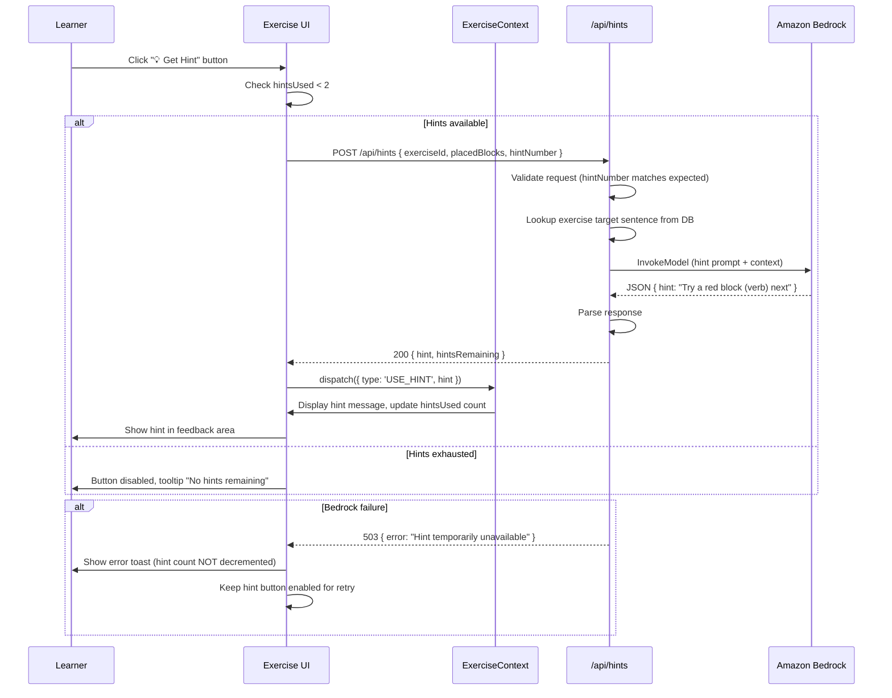
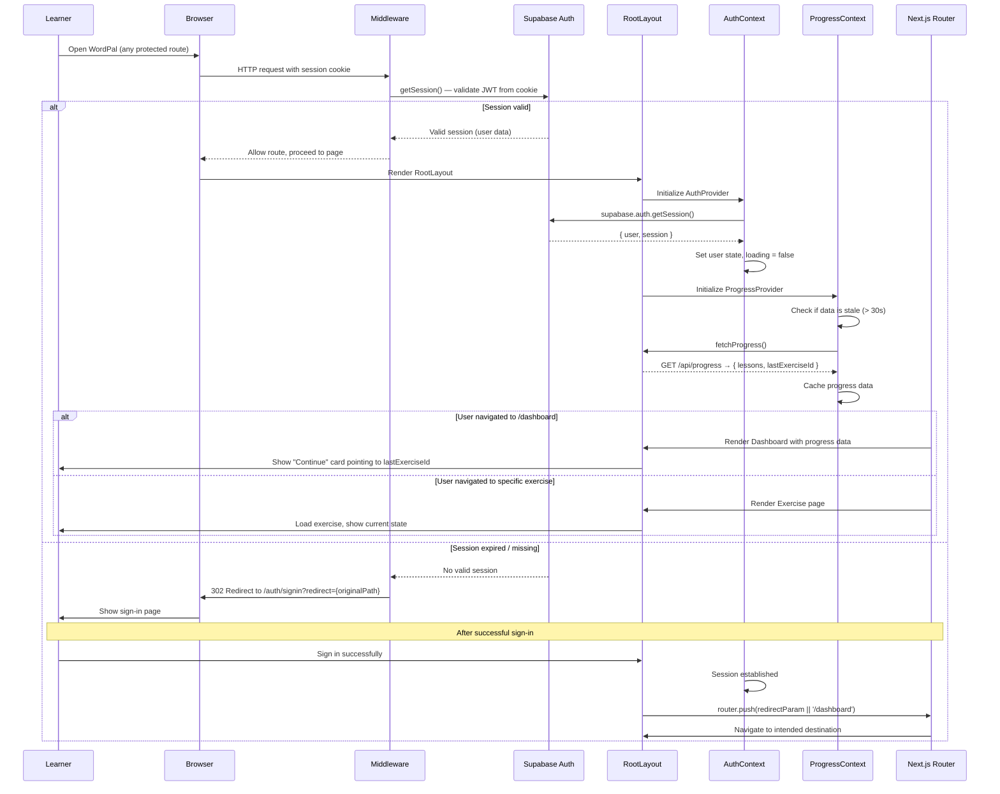

# WordPal — Technical Design Document

## Overview

WordPal is a gamified English sentence-building web application where learners visually construct sentences by dragging color-coded grammar blocks onto a canvas. An AI engine powered by Amazon Bedrock provides real-time feedback on grammatical correctness. The app targets language learners at beginner-to-intermediate levels and is designed as a hackathon MVP optimized for demo impact.

**Stack:** Next.js 14 (App Router) + Tailwind CSS + Supabase (Auth + Postgres) + Amazon Bedrock

**Visual Design Philosophy:** A hybrid aesthetic combining:
- **Duolingo** — playful color, gamification cues, celebratory micro-animations
- **Notion** — clean whitespace, readable typography, minimal chrome
- **Linear** — modern polish, subtle gradients, sharp focus states
- **Stripe** — professional elegance, refined spacing, smooth transitions

---

## Architecture

### High-Level Architecture

```mermaid
graph TD
    subgraph Client ["Next.js Frontend (Vercel)"]
        A[Pages / App Router] --> B[React Components]
        B --> C[DnD Engine - dnd-kit]
        B --> D[State Management - React Context]
    end

    subgraph API ["Next.js API Routes"]
        E[/api/feedback] --> F[Bedrock Service]
        G[/api/progress] --> H[Supabase Client]
        I[/api/hints] --> F
    end

    subgraph External ["External Services"]
        F --> J[Amazon Bedrock - Claude]
        H --> K[Supabase Postgres]
        L[Supabase Auth]
    end

    D --> E
    D --> G
    D --> I
    A --> L
```

### Request Flow



### Key Architectural Decisions

| Decision | Choice | Rationale |
|----------|--------|-----------|
| Drag-and-drop library | `@dnd-kit/core` | Accessible, performant, touch support, small bundle |
| State management | React Context + useReducer | Sufficient for MVP scope, no extra dependency |
| API layer | Next.js Route Handlers | Co-located, serverless, fast cold starts |
| Auth | Supabase Auth (email/password) | Free tier, session management built-in, fast setup |
| Database | Supabase Postgres | Free tier, real-time capabilities, row-level security |
| AI model | Amazon Bedrock (Claude Haiku) | Fast response times, cost-effective for MVP |
| Styling | Tailwind CSS + CSS variables | Rapid prototyping, design token consistency |
| Deployment | Vercel | Zero-config Next.js hosting, preview deploys |

---

## Components and Interfaces

### User Flow



### Screen List

| # | Screen | Route | Purpose | Priority |
|---|--------|-------|---------|----------|
| 1 | Landing | `/` | Brand impression, CTA | MVP |
| 2 | Sign In | `/auth/signin` | Email/password login | MVP |
| 3 | Register | `/auth/register` | Account creation | MVP |
| 4 | Home Dashboard | `/dashboard` | Lesson overview, quick stats | MVP |
| 5 | Exercise Screen | `/lessons/[lessonId]/exercises/[exerciseId]` | Core gameplay — drag & drop | MVP |
| 6 | Lesson Complete | `/lessons/[lessonId]/complete` | Celebration + summary | MVP |
| 7 | Progress Dashboard | `/progress` | Stats, completion bars | MVP |
| 8 | Leaderboard | `/leaderboard` | Rankings table | Stretch |

### Wireframes (Text-Based)

#### Landing Page
```
┌─────────────────────────────────────────────────────┐
│  [Logo: WordPal]                        [Sign In]   │
├─────────────────────────────────────────────────────┤
│                                                     │
│              🧩 WordPal                             │
│                                                     │
│     "Build English, Block by Block"                 │
│                                                     │
│     ┌──────────────────────────┐                    │
│     │   ▶ Start Learning       │  ← Primary CTA    │
│     └──────────────────────────┘                    │
│                                                     │
│  ┌─────┐ ┌─────┐ ┌─────┐ ┌─────┐                  │
│  │ The │ │ cat │ │ sat │ │ on  │  ← Animated       │
│  │BLUE │ │GREEN│ │ RED │ │YELO │    demo blocks    │
│  └─────┘ └─────┘ └─────┘ └─────┘                  │
│                                                     │
│  Feature highlights: AI Feedback • Progress •       │
│  Gamification                                       │
└─────────────────────────────────────────────────────┘
```

#### Exercise Screen (Core Gameplay)
```
┌─────────────────────────────────────────────────────┐
│  ← Back    Lesson 1: Simple Present    [3/5] ●●●○○ │
├─────────────────────────────────────────────────────┤
│                                                     │
│  📝 Sentence Preview:                               │
│  ┌─────────────────────────────────────────────┐    │
│  │ "The cat sits on the mat"                   │    │
│  └─────────────────────────────────────────────┘    │
│                                                     │
│  ─── Sentence Canvas (drop zone) ──────────────     │
│  ┌─────────────────────────────────────────────┐    │
│  │  ┌─────┐ ┌──────┐ ┌──────┐ ┌─────┐        │    │
│  │  │ The │ │ cat  │ │ sits │ │ on  │  ...    │    │
│  │  │ 🔵  │ │  🟢  │ │  🔴  │ │ 🟡  │        │    │
│  │  └─────┘ └──────┘ └──────┘ └─────┘        │    │
│  └─────────────────────────────────────────────┘    │
│                                                     │
│  ─── Available Blocks ─────────────────────────     │
│  ┌──────┐ ┌─────┐ ┌──────┐ ┌─────┐ ┌──────┐       │
│  │ mat  │ │ the │ │ runs │ │ big │ │ here │       │
│  │  🟢  │ │ 🔵  │ │  🔴  │ │ 🟡  │ │  🟡  │       │
│  └──────┘ └─────┘ └──────┘ └─────┘ └──────┘       │
│                                                     │
│  ┌────────────────┐         ┌───────────────────┐   │
│  │ 💡 Get Hint    │         │  ✓ Check Sentence │   │
│  └────────────────┘         └───────────────────┘   │
│                                                     │
│  ─── Feedback Area ────────────────────────────     │
│  ┌─────────────────────────────────────────────┐    │
│  │  ✅ Great job! Your sentence is correct.    │    │
│  │  The subject-verb-object order is perfect.  │    │
│  └─────────────────────────────────────────────┘    │
│                                                     │
└─────────────────────────────────────────────────────┘
```

#### Home Dashboard
```
┌─────────────────────────────────────────────────────┐
│  [Logo]  Home   Progress   Leaderboard   [Sign Out] │
├─────────────────────────────────────────────────────┤
│                                                     │
│  👋 Welcome back, Monica!                           │
│                                                     │
│  ─── Continue Learning ────────────────────────     │
│  ┌─────────────────────────────────────────────┐    │
│  │  📖 Lesson 1: Simple Present                │    │
│  │  ████████░░ 60%  (3/5 exercises)            │    │
│  │  [Continue →]                               │    │
│  └─────────────────────────────────────────────┘    │
│                                                     │
│  ─── All Lessons ──────────────────────────────     │
│  ┌──────────────────┐ ┌──────────────────┐          │
│  │ 📖 Simple Present│ │ 📖 Simple Past   │          │
│  │ ████████░░ 60%   │ │ ░░░░░░░░░░  0%   │          │
│  │ ✓ 3/5            │ │ 🔒 Locked        │          │
│  └──────────────────┘ └──────────────────┘          │
│  ┌──────────────────┐                               │
│  │ 📖 Questions     │                               │
│  │ ░░░░░░░░░░  0%   │                               │
│  │ 🔒 Locked        │                               │
│  └──────────────────┘                               │
│                                                     │
└─────────────────────────────────────────────────────┘
```

#### Progress Dashboard
```
┌─────────────────────────────────────────────────────┐
│  [Logo]  Home   Progress   Leaderboard   [Sign Out] │
├─────────────────────────────────────────────────────┤
│                                                     │
│  📊 Your Progress                                   │
│                                                     │
│  Total Exercises Completed: 8 / 15                  │
│  Overall: ██████████░░░░░ 53%                       │
│                                                     │
│  ┌─────────────────────────────────────────────┐    │
│  │ Lesson 1: Simple Present     ████████░░ 60% │    │
│  │ Lesson 2: Simple Past        ██░░░░░░░░ 20% │    │
│  │ Lesson 3: Questions          ░░░░░░░░░░  0% │    │
│  └─────────────────────────────────────────────┘    │
│                                                     │
│  🏆 Achievements                                    │
│  [First Sentence ✓] [5 in a row ✓] [Lesson 1 ✓]   │
│                                                     │
└─────────────────────────────────────────────────────┘
```

### Component Hierarchy



### Key Component Interfaces

```typescript
// Grammar Block
interface GrammarBlock {
  id: string;
  label: string;
  category: 'subject' | 'verb' | 'object' | 'modifier';
  isDistractor: boolean;
}

// Exercise
interface Exercise {
  id: string;
  lessonId: string;
  order: number;
  targetSentence: string;
  blocks: GrammarBlock[];
  maxBlocks: 15;
}

// Feedback Response
interface FeedbackResponse {
  correct: boolean;
  message: string;
  errorType?: string;
  suggestedSentence?: string;
}

// Sentence Canvas State
interface CanvasState {
  placedBlocks: GrammarBlock[];
  availableBlocks: GrammarBlock[];
  sentencePreview: string;
}

// DraggableBlock Props
interface DraggableBlockProps {
  block: GrammarBlock;
  isDragging: boolean;
  isIncorrect: boolean;
  onTap: () => void; // For touch: tap-to-place
}

// FeedbackPanel Props
interface FeedbackPanelProps {
  status: 'idle' | 'loading' | 'success' | 'error' | 'service-unavailable';
  feedback: FeedbackResponse | null;
  onRetry: () => void;
}

// ProgressBar Props
interface ProgressBarProps {
  completed: number;
  total: number;
  colorScheme: 'blue' | 'green' | 'purple';
}
```

### API Interfaces

```typescript
// POST /api/feedback
interface FeedbackRequest {
  sentence: string;
  exerciseId: string;
}
// Response: FeedbackResponse

// POST /api/progress
interface ProgressUpdateRequest {
  exerciseId: string;
  lessonId: string;
  score: number; // 0-100
  completedAt: string; // ISO timestamp
}

// GET /api/progress
interface ProgressResponse {
  lessons: {
    lessonId: string;
    title: string;
    completedExercises: number;
    totalExercises: number;
    percentage: number;
  }[];
  lastExerciseId: string | null;
}

// POST /api/hints
interface HintRequest {
  exerciseId: string;
  placedBlocks: string[]; // block IDs currently on canvas
  hintNumber: 1 | 2;
}
interface HintResponse {
  hint: string;
  hintsRemaining: number;
}
```

---

## Data Models

### Database Schema (Supabase Postgres)



### Lesson Data (Seed Data — Stored in JSON)

For the MVP, lesson and exercise content is seeded from a JSON file at build time:

```typescript
interface LessonSeed {
  id: string;
  title: string;
  description: string;
  order: number;
  grammarConcept: string;
  exercises: ExerciseSeed[];
}

interface ExerciseSeed {
  id: string;
  order: number;
  targetSentence: string;
  blocks: {
    label: string;
    category: 'subject' | 'verb' | 'object' | 'modifier';
    isDistractor: boolean;
  }[];
}
```

### State Management Model

```typescript
// Exercise Reducer State
interface ExerciseState {
  exercise: Exercise;
  canvas: GrammarBlock[];       // Blocks on canvas (ordered)
  available: GrammarBlock[];    // Blocks in pool
  feedback: FeedbackResponse | null;
  feedbackStatus: 'idle' | 'loading' | 'success' | 'error' | 'unavailable';
  hintsUsed: number;
  attempts: number;
  incorrectBlockIds: string[];  // Blocks flagged as wrong position
}

type ExerciseAction =
  | { type: 'PLACE_BLOCK'; blockId: string; index: number }
  | { type: 'REMOVE_BLOCK'; blockId: string }
  | { type: 'REORDER_BLOCKS'; fromIndex: number; toIndex: number }
  | { type: 'SUBMIT_START' }
  | { type: 'SUBMIT_SUCCESS'; feedback: FeedbackResponse }
  | { type: 'SUBMIT_ERROR' }
  | { type: 'USE_HINT'; hint: string }
  | { type: 'RESET' };
```

---

## Visual Design System

### Color Palette

```
┌─────────────────────────────────────────────────────────────────┐
│ GRAMMAR BLOCK COLORS (Duolingo-inspired, vibrant)               │
├─────────────────────────────────────────────────────────────────┤
│ Subject (Blue)   : #3B82F6 (bg) / #1D4ED8 (border) / #EFF6FF  │
│ Verb (Red)       : #EF4444 (bg) / #B91C1C (border) / #FEF2F2  │
│ Object (Green)   : #22C55E (bg) / #15803D (border) / #F0FDF4  │
│ Modifier (Yellow): #F59E0B (bg) / #B45309 (border) / #FFFBEB  │
├─────────────────────────────────────────────────────────────────┤
│ INTERFACE COLORS (Linear/Stripe-inspired, professional)         │
├─────────────────────────────────────────────────────────────────┤
│ Background       : #FAFAFA (page) / #FFFFFF (card)             │
│ Surface          : #F4F4F5 (muted) / #E4E4E7 (border)         │
│ Text Primary     : #18181B                                      │
│ Text Secondary   : #71717A                                      │
│ Text Muted       : #A1A1AA                                      │
├─────────────────────────────────────────────────────────────────┤
│ ACCENT & FEEDBACK                                               │
├─────────────────────────────────────────────────────────────────┤
│ Primary (CTA)    : #6366F1 (indigo, Linear-like)               │
│ Primary Hover    : #4F46E5                                      │
│ Success          : #10B981 (emerald)                            │
│ Error            : #EF4444 (red)                                │
│ Warning          : #F59E0B (amber)                              │
│ Info             : #3B82F6 (blue)                               │
└─────────────────────────────────────────────────────────────────┘
```

### Tailwind Theme Extension

```javascript
// tailwind.config.js (partial)
{
  theme: {
    extend: {
      colors: {
        block: {
          subject: { DEFAULT: '#3B82F6', dark: '#1D4ED8', light: '#EFF6FF' },
          verb: { DEFAULT: '#EF4444', dark: '#B91C1C', light: '#FEF2F2' },
          object: { DEFAULT: '#22C55E', dark: '#15803D', light: '#F0FDF4' },
          modifier: { DEFAULT: '#F59E0B', dark: '#B45309', light: '#FFFBEB' },
        },
        surface: { DEFAULT: '#FAFAFA', card: '#FFFFFF', muted: '#F4F4F5' },
        accent: { DEFAULT: '#6366F1', hover: '#4F46E5' },
      },
      fontFamily: {
        sans: ['Inter', 'system-ui', 'sans-serif'],
        display: ['Cal Sans', 'Inter', 'sans-serif'],
      },
    },
  },
}
```

### Typography

| Element | Font | Size | Weight | Line Height | Usage |
|---------|------|------|--------|-------------|-------|
| Display/Hero | Cal Sans | 48px / `text-5xl` | 700 | 1.1 | Landing page heading |
| Page Title | Inter | 30px / `text-3xl` | 700 | 1.2 | Dashboard headings |
| Section Title | Inter | 20px / `text-xl` | 600 | 1.4 | Card titles, lesson names |
| Body | Inter | 16px / `text-base` | 400 | 1.6 | Paragraph text, descriptions |
| Block Label | Inter | 14px / `text-sm` | 600 | 1.0 | Grammar block text |
| Caption | Inter | 12px / `text-xs` | 400 | 1.4 | Helper text, metadata |
| Feedback | Inter | 15px | 500 | 1.5 | AI feedback messages |

### Spacing System

Based on a 4px grid (Tailwind default):
- **Micro:** 4px (`space-1`) — inside blocks, tight gaps
- **Small:** 8px (`space-2`) — between related items
- **Medium:** 16px (`space-4`) — between components
- **Large:** 24px (`space-6`) — section spacing
- **XL:** 32px (`space-8`) — page-level margins
- **2XL:** 48px (`space-12`) — major section breaks

### Border Radius

- **Block:** `rounded-lg` (8px) — grammar blocks
- **Card:** `rounded-xl` (12px) — cards, panels
- **Button:** `rounded-lg` (8px) — action buttons
- **Input:** `rounded-md` (6px) — form fields
- **Full:** `rounded-full` — avatars, badges

### Shadows

- **Block resting:** `shadow-sm` — subtle depth
- **Block dragging:** `shadow-xl` + `ring-2 ring-accent/30` — elevated, active feel
- **Card:** `shadow-sm` — Notion-like flat cards
- **Modal/Overlay:** `shadow-2xl` — strong elevation

### Animations

| Animation | Trigger | Duration | Easing | Properties |
|-----------|---------|----------|--------|------------|
| Block pickup | Drag start | 150ms | `ease-out` | `scale(1.05)`, `shadow-xl`, `opacity(0.9)` |
| Block drop | Drag end | 200ms | `ease-in-out` | `scale(1.0)`, position snap |
| Block insert | New block placed | 300ms | `spring(stiff)` | Width expansion, fade-in |
| Feedback fade-in | API response | 300ms | `ease-out` | `opacity(0→1)`, `translateY(8→0)` |
| Success celebration | Correct answer | 600ms | `ease-out` | Confetti particles + scale bounce |
| Progress fill | Exercise complete | 500ms | `ease-in-out` | Width `0% → X%` |
| Shake (error) | Incorrect block | 400ms | `ease-in-out` | `translateX(±4px)` oscillation |
| Skeleton pulse | Loading state | 1500ms | `ease-in-out` | Opacity `0.5 → 1.0` (loop) |
| Page transition | Route change | 200ms | `ease-out` | `opacity(0→1)`, `translateY(4→0)` |
| Button hover | Mouse enter | 150ms | `ease-out` | `scale(1.02)`, color shift |
| Toast enter | Notification | 300ms | `spring` | `translateY(-100% → 0)` |

### Responsive Layout

| Breakpoint | Width | Layout Adaptations |
|------------|-------|--------------------|
| Tablet | 768px–1023px | Single column, blocks wrap to 2 rows, nav collapses to hamburger |
| Desktop | 1024px–1279px | Two-column where applicable, full nav |
| Wide | 1280px+ | Max-width container (1200px), generous whitespace |

**Exercise Screen Responsive Behavior:**
- **≥1024px:** Canvas and block pool side by side (or stacked with generous width)
- **768px–1023px:** Full-width stacked layout. Blocks wrap into multiple rows. Touch targets enlarged to 44×44px minimum
- **Canvas:** Minimum height 120px, flexbox with wrap for placed blocks

---


## Correctness Properties

*A property is a characteristic or behavior that should hold true across all valid executions of a system — essentially, a formal statement about what the system should do. Properties serve as the bridge between human-readable specifications and machine-verifiable correctness guarantees.*

### Property 1: Block insertion preserves relative order

*For any* ordered list of blocks on the canvas and any valid insertion index (0 to length), inserting a new block at that index should result in a canvas where the new block is at the specified index and all previously-placed blocks maintain their original relative order.

**Validates: Requirements 1.1**

### Property 2: Tap-to-place appends block at end

*For any* canvas state with N blocks (where N < 15) and any available block, tapping that block should result in a canvas of N+1 blocks where the tapped block is at index N (the last position).

**Validates: Requirements 1.6**

### Property 3: Block removal round-trip

*For any* canvas containing at least one block, removing a block from the canvas should result in the block appearing in the available pool and not appearing on the canvas, and the canvas length should decrease by exactly one.

**Validates: Requirements 1.4**

### Property 4: Sentence preview is ordered label concatenation

*For any* non-empty list of blocks on the canvas, the sentence preview string should equal the block labels joined by single spaces in their left-to-right canvas order.

**Validates: Requirements 1.3, 1.5**

### Property 5: Input length validation

*For any* string that is empty (length 0) or exceeds 200 characters, the feedback submission should be rejected. *For any* non-empty string of 1–200 characters, the submission should be accepted for processing.

**Validates: Requirements 2.7**

### Property 6: Exercise ordering invariant

*For any* lesson in the system, the exercises should be ordered such that each successive exercise requires an equal or greater number of grammar blocks to form the target sentence than the previous exercise.

**Validates: Requirements 3.2**

### Property 7: Exercise state machine transitions

*For any* lesson with N exercises and any progress state, the exercise statuses should satisfy: (a) completed exercises are all contiguous from the start, (b) the first incomplete exercise is "available", and (c) all exercises after the first incomplete one are "locked". When an available exercise is completed, the next exercise transitions from locked to available.

**Validates: Requirements 3.3, 3.4, 3.8**

### Property 8: Block count invariant per exercise

*For any* exercise, the total number of provided blocks should equal the number of words in the target sentence plus the number of distractor blocks, where the distractor count is between 0 and 3 inclusive.

**Validates: Requirements 3.5**

### Property 9: Incorrect block identification accuracy

*For any* arrangement of blocks on the canvas that does not match the target sentence, the set of blocks flagged as incorrect should be exactly those blocks whose current position differs from their position in the target sentence ordering.

**Validates: Requirements 3.7**

### Property 10: Progress computation consistency

*For any* set of exercise completion records for a user, the progress dashboard should display: (a) completed count equal to the number of records with `completed = true`, (b) percentage equal to `(completed / total) * 100` rounded to nearest integer, and (c) percentage bounded within [0, 100].

**Validates: Requirements 5.1, 5.2, 5.4**

### Property 11: Next exercise derivation

*For any* progress state across all lessons, the "resume" position should point to the first exercise (by lesson order, then exercise order) that is not marked as completed. If all exercises are completed, resume should point to the last exercise.

**Validates: Requirements 5.3**

### Property 12: Hint count limit invariant

*For any* exercise attempt, the number of successfully delivered hints should never exceed 2. After 2 hints are delivered, all subsequent hint requests should be rejected.

**Validates: Requirements 7.2**

### Property 13: Leaderboard sort order

*For any* set of leaderboard entries, the displayed order should satisfy: entries are sorted by total exercises completed in descending order, and entries with equal exercise counts are sorted by earliest completion timestamp in ascending order.

**Validates: Requirements 8.1**

### Property 14: Leaderboard score increment

*For any* exercise completion event for a user, that user's leaderboard score should increase by exactly 1 compared to their score before the completion.

**Validates: Requirements 8.2**

---

## Error Handling

### Error Categories and Responses

| Error Scenario | User-Facing Message | Recovery Action |
|---------------|--------------------|--------------------|
| Bedrock timeout (>3s) | "AI feedback is temporarily unavailable." | Show retry button |
| Bedrock error (5xx) | "AI feedback is temporarily unavailable." | Show retry button |
| Empty/oversized input | "Sentences must be between 1 and 200 characters." | Highlight input, keep state |
| Progress save failure | "Your progress couldn't be saved. Please try again." | Retain state, show retry |
| Auth failure (invalid creds) | "Email or password is incorrect." | Clear password field |
| Duplicate registration | "This email is already in use." | Suggest sign-in link |
| Session expired | Silent redirect to sign-in | Preserve intended route for post-login redirect |
| Hint generation failure | "Hint unavailable right now. Try again." | Don't decrement hint count |
| TTS failure | "Audio unavailable at the moment." | Hide play button gracefully |
| Network offline | "You appear to be offline. Check your connection." | Queue actions for retry |
| Block limit reached (15) | "Maximum blocks reached. Remove one to add another." | Bounce animation on canvas |

### Error Handling Principles

1. **Never lose user work** — if progress can't save, retain the learner's input and allow retry
2. **Degrade gracefully** — AI/TTS failures should not block core gameplay
3. **Be specific but safe** — auth errors should not reveal whether email or password was wrong
4. **Provide escape hatches** — always offer retry or alternative path
5. **Use appropriate feedback modality** — inline messages for form errors, toast for system issues, modal for blocking errors

### Client-Side Error Boundaries

```typescript
// Error boundary hierarchy
RootErrorBoundary          // Catches fatal errors, shows full-page fallback
├── AuthErrorBoundary      // Handles session expiry → redirect to sign-in
├── ExerciseErrorBoundary  // Catches exercise-level errors, allows lesson restart
└── FeedbackErrorBoundary  // Isolates AI feedback failures from exercise state
```

---

## Testing Strategy

### Dual Testing Approach

This feature uses **property-based testing** for core logic (sentence construction, progress computation, state management) and **example-based tests** for integration points, UI behavior, and edge cases.

### Property-Based Testing

**Library:** `fast-check` (TypeScript PBT library)
**Configuration:** Minimum 100 iterations per property
**Tag format:** `Feature: wordpal, Property {N}: {description}`

Properties to implement:
- Properties 1–4: Sentence canvas logic (block insertion, removal, concatenation)
- Property 5: Input validation
- Properties 6–9: Exercise and lesson logic
- Properties 10–11: Progress computation
- Property 12: Hint limiting
- Properties 13–14: Leaderboard ordering and scoring

### Unit Tests (Example-Based)

| Area | Tests |
|------|-------|
| Block color mapping | 4 cases (subject→blue, verb→red, object→green, modifier→yellow) |
| Auth error messages | Generic message for invalid creds, duplicate email message |
| Exercise initial state | First available, rest locked |
| Lesson completion summary | Correct first-attempt count |
| Landing page content | Logo, tagline, CTA present |
| Loading indicator | Appears during feedback request |

### Integration Tests

| Area | Tests |
|------|-------|
| Bedrock feedback flow | Mock Bedrock → verify response format |
| Supabase progress CRUD | Mock Supabase → verify read/write |
| Auth middleware | Protected route redirect |
| Hint generation | Mock Bedrock → verify hint format |

### Edge Case Tests

Covered by property-based test generators:
- Canvas at 15-block limit (rejection)
- Drop outside canvas (no-op)
- Bedrock timeout (retry UI)
- Progress save failure (error + retain)
- Hint failure (no decrement)
- Empty/whitespace-only input
- 201+ character input

### Test Execution

```bash
# Run all tests
npm run test

# Run property tests only
npm run test -- --grep "Property"

# Run with coverage
npm run test:coverage
```

### Manual Testing Checklist (Demo Day)

- [ ] Drag-and-drop smooth at 30fps on Chrome/Safari
- [ ] Touch tap-to-place works on iPad
- [ ] Feedback appears within 3 seconds
- [ ] Progress persists across page refreshes
- [ ] Responsive layout correct at 768px and 1920px
- [ ] Animations feel polished (no jank)
- [ ] Error states display correctly
- [ ] Full lesson flow: start → complete all exercises → summary


---

## Project Folder Structure

```
wordpal/
├── .env.local                          # Local env vars (SUPABASE_URL, BEDROCK keys)
├── .env.example                        # Template for env vars
├── next.config.js                      # Next.js configuration
├── tailwind.config.js                  # Tailwind theme (block colors, fonts)
├── tsconfig.json                       # TypeScript configuration
├── package.json                        # Dependencies and scripts
├── postcss.config.js                   # PostCSS (Tailwind)
├── middleware.ts                       # Next.js middleware (auth guard)
├── public/
│   ├── logo.svg                        # WordPal logo
│   └── favicon.ico
├── src/
│   ├── app/
│   │   ├── layout.tsx                  # Root layout (providers, nav)
│   │   ├── page.tsx                    # Landing page (/)
│   │   ├── globals.css                 # Tailwind directives + CSS vars
│   │   ├── auth/
│   │   │   ├── signin/
│   │   │   │   └── page.tsx            # Sign-in page
│   │   │   └── register/
│   │   │       └── page.tsx            # Registration page
│   │   ├── dashboard/
│   │   │   └── page.tsx                # Home dashboard
│   │   ├── lessons/
│   │   │   └── [lessonId]/
│   │   │       ├── page.tsx            # Lesson overview (exercise list)
│   │   │       ├── complete/
│   │   │       │   └── page.tsx        # Lesson completion summary
│   │   │       └── exercises/
│   │   │           └── [exerciseId]/
│   │   │               └── page.tsx    # Core exercise screen
│   │   ├── progress/
│   │   │   └── page.tsx                # Progress dashboard
│   │   ├── leaderboard/
│   │   │   └── page.tsx                # Leaderboard (stretch)
│   │   └── api/
│   │       ├── feedback/
│   │       │   └── route.ts            # POST /api/feedback
│   │       ├── progress/
│   │       │   └── route.ts            # GET & POST /api/progress
│   │       ├── hints/
│   │       │   └── route.ts            # POST /api/hints
│   │       └── leaderboard/
│   │           └── route.ts            # GET /api/leaderboard
│   ├── components/
│   │   ├── ui/                         # Generic UI primitives
│   │   │   ├── Button.tsx
│   │   │   ├── Card.tsx
│   │   │   ├── ProgressBar.tsx
│   │   │   ├── LoadingSpinner.tsx
│   │   │   ├── Toast.tsx
│   │   │   └── Skeleton.tsx
│   │   ├── exercise/                   # Exercise-specific components
│   │   │   ├── DraggableBlock.tsx
│   │   │   ├── SentenceCanvas.tsx
│   │   │   ├── AvailableBlocks.tsx
│   │   │   ├── SentencePreview.tsx
│   │   │   ├── FeedbackPanel.tsx
│   │   │   ├── HintButton.tsx
│   │   │   ├── SubmitButton.tsx
│   │   │   └── ExerciseHeader.tsx
│   │   ├── dashboard/                  # Dashboard components
│   │   │   ├── WelcomeCard.tsx
│   │   │   ├── ContinueCard.tsx
│   │   │   ├── LessonCard.tsx
│   │   │   └── LessonGrid.tsx
│   │   ├── auth/                       # Auth form components
│   │   │   ├── SignInForm.tsx
│   │   │   └── RegisterForm.tsx
│   │   ├── layout/                     # Layout components
│   │   │   ├── NavBar.tsx
│   │   │   └── PageContainer.tsx
│   │   └── leaderboard/
│   │       └── LeaderboardTable.tsx
│   ├── lib/
│   │   ├── services/
│   │   │   ├── bedrock.ts              # Amazon Bedrock client + prompts
│   │   │   ├── supabase-server.ts      # Supabase server client
│   │   │   └── supabase-browser.ts     # Supabase browser client
│   │   ├── utils/
│   │   │   ├── sentence.ts             # Sentence construction helpers
│   │   │   ├── validation.ts           # Input validation
│   │   │   ├── progress.ts             # Progress computation logic
│   │   │   └── exercise.ts             # Exercise state helpers
│   │   └── hooks/
│   │       ├── useExercise.ts           # Exercise reducer hook
│   │       ├── useAuth.ts              # Auth session hook
│   │       └── useProgress.ts          # Progress data hook
│   ├── contexts/
│   │   ├── AuthContext.tsx             # Supabase auth provider
│   │   ├── ExerciseContext.tsx         # Exercise state provider
│   │   └── ProgressContext.tsx         # Progress cache provider
│   ├── types/
│   │   ├── index.ts                    # Shared type exports
│   │   ├── exercise.ts                 # Exercise, Block, Canvas types
│   │   ├── feedback.ts                 # Feedback request/response types
│   │   └── progress.ts                 # Progress types
│   └── data/
│       └── lessons.json                # Seed data: lessons + exercises + blocks
└── tests/
    ├── properties/                     # Property-based tests (fast-check)
    │   ├── canvas.property.test.ts
    │   ├── progress.property.test.ts
    │   ├── exercise.property.test.ts
    │   └── leaderboard.property.test.ts
    ├── unit/                           # Example-based unit tests
    │   ├── validation.test.ts
    │   ├── sentence.test.ts
    │   └── auth.test.ts
    └── integration/                    # Integration tests (mocked services)
        ├── feedback-api.test.ts
        ├── progress-api.test.ts
        └── hints-api.test.ts
```

---

## Database DDL (SQL)

Full Supabase Postgres schema with Row-Level Security policies.

```sql
-- ============================================================
-- TABLES
-- ============================================================

-- Users: extends Supabase auth.users with profile info
CREATE TABLE public.users (
  id UUID PRIMARY KEY REFERENCES auth.users(id) ON DELETE CASCADE,
  email TEXT NOT NULL,
  display_name TEXT NOT NULL DEFAULT '',
  created_at TIMESTAMPTZ NOT NULL DEFAULT NOW(),
  updated_at TIMESTAMPTZ NOT NULL DEFAULT NOW()
);

-- Lessons: grammar concept groupings
CREATE TABLE public.lessons (
  id UUID PRIMARY KEY DEFAULT gen_random_uuid(),
  title TEXT NOT NULL,
  description TEXT NOT NULL DEFAULT '',
  "order" INTEGER NOT NULL,
  grammar_concept TEXT NOT NULL,
  created_at TIMESTAMPTZ NOT NULL DEFAULT NOW()
);

-- Exercises: individual sentence-building challenges
CREATE TABLE public.exercises (
  id UUID PRIMARY KEY DEFAULT gen_random_uuid(),
  lesson_id UUID NOT NULL REFERENCES public.lessons(id) ON DELETE CASCADE,
  "order" INTEGER NOT NULL,
  target_sentence TEXT NOT NULL,
  max_blocks INTEGER NOT NULL DEFAULT 15,
  created_at TIMESTAMPTZ NOT NULL DEFAULT NOW()
);

-- Exercise Blocks: the draggable word blocks per exercise
CREATE TABLE public.exercise_blocks (
  id UUID PRIMARY KEY DEFAULT gen_random_uuid(),
  exercise_id UUID NOT NULL REFERENCES public.exercises(id) ON DELETE CASCADE,
  label TEXT NOT NULL,
  category TEXT NOT NULL CHECK (category IN ('subject', 'verb', 'object', 'modifier')),
  is_distractor BOOLEAN NOT NULL DEFAULT FALSE,
  source_order INTEGER NOT NULL DEFAULT 0
);

-- User Progress: tracks completion per exercise per user
CREATE TABLE public.user_progress (
  id UUID PRIMARY KEY DEFAULT gen_random_uuid(),
  user_id UUID NOT NULL REFERENCES public.users(id) ON DELETE CASCADE,
  exercise_id UUID NOT NULL REFERENCES public.exercises(id) ON DELETE CASCADE,
  score INTEGER NOT NULL DEFAULT 0 CHECK (score >= 0 AND score <= 100),
  completed BOOLEAN NOT NULL DEFAULT FALSE,
  completed_at TIMESTAMPTZ,
  attempts INTEGER NOT NULL DEFAULT 0,
  created_at TIMESTAMPTZ NOT NULL DEFAULT NOW(),
  updated_at TIMESTAMPTZ NOT NULL DEFAULT NOW(),
  UNIQUE (user_id, exercise_id)
);

-- ============================================================
-- INDEXES
-- ============================================================

CREATE INDEX idx_exercises_lesson_id ON public.exercises(lesson_id);
CREATE INDEX idx_exercises_lesson_order ON public.exercises(lesson_id, "order");
CREATE INDEX idx_exercise_blocks_exercise_id ON public.exercise_blocks(exercise_id);
CREATE INDEX idx_user_progress_user_id ON public.user_progress(user_id);
CREATE INDEX idx_user_progress_user_exercise ON public.user_progress(user_id, exercise_id);
CREATE INDEX idx_user_progress_completed ON public.user_progress(user_id, completed);
CREATE INDEX idx_lessons_order ON public.lessons("order");

-- ============================================================
-- ROW-LEVEL SECURITY (RLS)
-- ============================================================

-- Enable RLS on user_progress
ALTER TABLE public.user_progress ENABLE ROW LEVEL SECURITY;

-- Users can only read their own progress
CREATE POLICY "Users can read own progress"
  ON public.user_progress
  FOR SELECT
  USING (auth.uid() = user_id);

-- Users can insert their own progress
CREATE POLICY "Users can insert own progress"
  ON public.user_progress
  FOR INSERT
  WITH CHECK (auth.uid() = user_id);

-- Users can update their own progress
CREATE POLICY "Users can update own progress"
  ON public.user_progress
  FOR UPDATE
  USING (auth.uid() = user_id)
  WITH CHECK (auth.uid() = user_id);

-- Users can delete their own progress (account cleanup)
CREATE POLICY "Users can delete own progress"
  ON public.user_progress
  FOR DELETE
  USING (auth.uid() = user_id);

-- Enable RLS on users (profile table)
ALTER TABLE public.users ENABLE ROW LEVEL SECURITY;

-- Users can read their own profile
CREATE POLICY "Users can read own profile"
  ON public.users
  FOR SELECT
  USING (auth.uid() = id);

-- Users can update their own profile
CREATE POLICY "Users can update own profile"
  ON public.users
  FOR UPDATE
  USING (auth.uid() = id);

-- Allow reading display_name for leaderboard (all authenticated users)
CREATE POLICY "Authenticated users can read display names"
  ON public.users
  FOR SELECT
  USING (auth.role() = 'authenticated');

-- Lessons and exercises are publicly readable (no write from client)
ALTER TABLE public.lessons ENABLE ROW LEVEL SECURITY;
CREATE POLICY "Lessons are publicly readable"
  ON public.lessons FOR SELECT USING (true);

ALTER TABLE public.exercises ENABLE ROW LEVEL SECURITY;
CREATE POLICY "Exercises are publicly readable"
  ON public.exercises FOR SELECT USING (true);

ALTER TABLE public.exercise_blocks ENABLE ROW LEVEL SECURITY;
CREATE POLICY "Exercise blocks are publicly readable"
  ON public.exercise_blocks FOR SELECT USING (true);

-- ============================================================
-- TRIGGERS
-- ============================================================

-- Auto-update updated_at on user_progress changes
CREATE OR REPLACE FUNCTION update_updated_at_column()
RETURNS TRIGGER AS $$
BEGIN
  NEW.updated_at = NOW();
  RETURN NEW;
END;
$$ LANGUAGE plpgsql;

CREATE TRIGGER update_user_progress_updated_at
  BEFORE UPDATE ON public.user_progress
  FOR EACH ROW EXECUTE FUNCTION update_updated_at_column();

CREATE TRIGGER update_users_updated_at
  BEFORE UPDATE ON public.users
  FOR EACH ROW EXECUTE FUNCTION update_updated_at_column();

-- Auto-create user profile on auth.users signup
CREATE OR REPLACE FUNCTION handle_new_user()
RETURNS TRIGGER AS $$
BEGIN
  INSERT INTO public.users (id, email, display_name)
  VALUES (NEW.id, NEW.email, COALESCE(NEW.raw_user_meta_data->>'display_name', ''));
  RETURN NEW;
END;
$$ LANGUAGE plpgsql SECURITY DEFINER;

CREATE TRIGGER on_auth_user_created
  AFTER INSERT ON auth.users
  FOR EACH ROW EXECUTE FUNCTION handle_new_user();
```

---

## API Routes (Detailed)

### POST /api/feedback

Evaluates a learner's constructed sentence using Amazon Bedrock and returns grammar feedback.

**Auth:** Required (Supabase session token in `Authorization` header)

**Request Schema:**
```typescript
{
  sentence: string;      // 1–200 characters, non-empty
  exerciseId: string;    // UUID of the current exercise
}
```

**Response Schema (200 OK):**
```typescript
{
  correct: boolean;
  message: string;               // Max 2 sentences, CEFR B1 level
  errorType?: string;            // e.g. "subject-verb agreement", "word order"
  suggestedSentence?: string;    // Corrected version (only if incorrect)
}
```

**Error Responses:**
| Status | Body | Condition |
|--------|------|-----------|
| 400 | `{ error: "Sentence must be between 1 and 200 characters" }` | Empty or oversized input |
| 401 | `{ error: "Unauthorized" }` | Missing or invalid session |
| 503 | `{ error: "AI feedback temporarily unavailable" }` | Bedrock timeout (>3s) or error |

**Implementation Notes:**
- Validate input length before calling Bedrock
- Extract user session via `createRouteHandlerClient` from `@supabase/auth-helpers-nextjs`
- Call `BedrockRuntimeClient.invokeModel()` with `anthropic.claude-3-haiku-20240307-v1:0`
- Set AbortController timeout at 3000ms
- Parse Bedrock JSON response; if malformed, return 503
- Log errors to console (structured JSON) but never expose Bedrock details to client

### GET /api/progress

Retrieves the authenticated user's progress across all lessons.

**Auth:** Required

**Response Schema (200 OK):**
```typescript
{
  lessons: {
    lessonId: string;
    title: string;
    completedExercises: number;
    totalExercises: number;
    percentage: number;          // 0–100, rounded integer
  }[];
  lastExerciseId: string | null; // For "resume" navigation
  totalCompleted: number;
  totalExercises: number;
}
```

**Error Responses:**
| Status | Body | Condition |
|--------|------|-----------|
| 401 | `{ error: "Unauthorized" }` | Missing or invalid session |
| 500 | `{ error: "Failed to load progress" }` | Supabase query failure |

**Implementation Notes:**
- Join `user_progress` with `exercises` and `lessons` tables
- Compute percentages server-side: `Math.round((completed / total) * 100)`
- Determine `lastExerciseId` by finding first incomplete exercise (ordered by lesson.order, exercise.order)
- Cache-Control: `private, no-cache` (progress is user-specific and changes frequently)

### POST /api/progress

Saves or updates progress for a specific exercise.

**Auth:** Required

**Request Schema:**
```typescript
{
  exerciseId: string;    // UUID
  lessonId: string;      // UUID
  score: number;         // 0–100
  completedAt: string;   // ISO 8601 timestamp
}
```

**Response Schema (200 OK):**
```typescript
{
  success: true;
  progress: {
    exerciseId: string;
    completed: boolean;
    score: number;
    attempts: number;
  }
}
```

**Error Responses:**
| Status | Body | Condition |
|--------|------|-----------|
| 400 | `{ error: "Invalid request body" }` | Missing fields or score out of range |
| 401 | `{ error: "Unauthorized" }` | Missing or invalid session |
| 500 | `{ error: "Failed to save progress" }` | Supabase upsert failure |

**Implementation Notes:**
- Upsert on `(user_id, exercise_id)` unique constraint
- Increment `attempts` counter on each submission
- Set `completed = true` and `completed_at` only if score >= threshold (currently any correct = 100)
- Validate that `exerciseId` and `lessonId` exist in the database

### POST /api/hints

Generates a contextual hint for the current exercise using Amazon Bedrock.

**Auth:** Required

**Request Schema:**
```typescript
{
  exerciseId: string;      // UUID
  placedBlocks: string[];  // Block IDs currently on canvas (ordered)
  hintNumber: 1 | 2;      // Which hint is being requested
}
```

**Response Schema (200 OK):**
```typescript
{
  hint: string;           // Natural language clue (category-based, not exact answer)
  hintsRemaining: number; // 0 or 1
}
```

**Error Responses:**
| Status | Body | Condition |
|--------|------|-----------|
| 400 | `{ error: "Invalid request" }` | Missing fields or hintNumber > 2 |
| 401 | `{ error: "Unauthorized" }` | Missing or invalid session |
| 429 | `{ error: "No hints remaining for this exercise" }` | Both hints already used |
| 503 | `{ error: "Hint temporarily unavailable" }` | Bedrock timeout or error |

**Implementation Notes:**
- Track hint usage in-memory per exercise attempt (client sends `hintNumber`)
- Server validates that hintNumber matches expected next hint (prevents skipping)
- Lookup exercise target sentence from database to construct hint prompt
- Use a different Bedrock prompt template than feedback (see Prompt Strategy)
- On Bedrock failure, return 503 and do NOT count as a used hint
- Timeout: 5000ms (hints can be slightly slower than feedback)

### GET /api/leaderboard

Retrieves the top 10 leaderboard entries plus the current user's rank.

**Auth:** Required

**Response Schema (200 OK):**
```typescript
{
  entries: {
    rank: number;
    userId: string;
    displayName: string;
    exercisesCompleted: number;
  }[];
  currentUser: {
    rank: number;
    exercisesCompleted: number;
  }
}
```

**Error Responses:**
| Status | Body | Condition |
|--------|------|-----------|
| 401 | `{ error: "Unauthorized" }` | Missing or invalid session |
| 500 | `{ error: "Failed to load leaderboard" }` | Supabase query failure |

**Implementation Notes:**
- Query: aggregate `user_progress` where `completed = true`, group by `user_id`, count exercises
- Join with `users` table for `display_name`
- Order by count DESC, then earliest `completed_at` ASC for tie-breaking
- Limit to 10 results for the main list
- Separate query (or window function) to determine current user's rank
- Cache-Control: `public, max-age=60` (leaderboard can be slightly stale)

---

## Amazon Bedrock Prompt Strategy

### Model Selection

**Model:** `anthropic.claude-3-haiku-20240307-v1:0`

**Rationale:**
- **Speed:** Haiku is the fastest model in the Claude 3 family (~200ms median latency for short prompts), critical for the 3-second feedback requirement
- **Cost:** Lowest cost per token — ideal for an MVP where every exercise submission triggers an invocation
- **Quality:** Sufficient for grammar evaluation at CEFR B1 level (simple sentence structures)
- **Availability:** Available in `us-east-1` with on-demand throughput

### Configuration

```typescript
const BEDROCK_CONFIG = {
  modelId: 'anthropic.claude-3-haiku-20240307-v1:0',
  region: 'us-east-1',
  feedback: {
    maxTokens: 150,        // Short feedback messages
    temperature: 0.2,      // Low temp = consistent, deterministic grammar eval
    topP: 0.9,
  },
  hints: {
    maxTokens: 100,        // Hints are brief
    temperature: 0.4,      // Slightly more creative for varied hints
    topP: 0.9,
  },
};
```

### Feedback Prompt Template

**System Prompt:**
```
You are a friendly English grammar tutor for beginner-to-intermediate learners.
Your job is to evaluate whether a sentence is grammatically correct.

Rules:
1. Respond ONLY with valid JSON matching the exact schema below.
2. Keep feedback at CEFR B1 level (simple vocabulary, short sentences).
3. The "message" field must be 1-2 sentences maximum.
4. If incorrect, identify the specific grammar error type.
5. If incorrect, provide the corrected sentence.
6. Never use technical linguistics jargon.
7. Be encouraging even when the sentence is wrong.

Response JSON schema:
{
  "correct": boolean,
  "message": "string (1-2 sentences, encouraging)",
  "errorType": "string | null (e.g. 'word order', 'subject-verb agreement', 'missing article')",
  "suggestedSentence": "string | null (corrected version)"
}
```

**User Prompt (Feedback):**
```
The learner constructed the following sentence by arranging word blocks:

Sentence: "${userSentence}"

The target sentence for this exercise is: "${targetSentence}"

Evaluate the learner's sentence for grammatical correctness. Respond with JSON only.
```

### Hint Prompt Template

**System Prompt:**
```
You are a helpful English grammar tutor giving hints to a learner who is stuck
building a sentence from word blocks. Each block belongs to a grammatical category:
subject (blue), verb (red), object (green), or modifier (yellow).

Rules:
1. Respond ONLY with valid JSON matching the schema below.
2. Give a CLUE about what type of block should come next, NOT the exact word.
3. Reference the color/category system (e.g. "Try a blue block next").
4. Keep hints at CEFR B1 level.
5. Do NOT reveal the complete answer or exact block position.
6. Be encouraging.

Response JSON schema:
{
  "hint": "string (1 sentence clue about the next block category/type)"
}
```

**User Prompt (Hint):**
```
The learner is building a sentence from word blocks.

Target sentence: "${targetSentence}"
Blocks placed so far (in order): [${placedBlockLabels.join(', ')}]
Hint number: ${hintNumber} of 2

The available blocks are: [${availableBlockLabels.join(', ')}]

Give a helpful clue about what type of block should come next.
Respond with JSON only.
```

### Response Parsing

```typescript
function parseFeedbackResponse(raw: string): FeedbackResponse {
  // Strip markdown code fences if present (Claude sometimes wraps in ```)
  const cleaned = raw.replace(/```json?\n?/g, '').replace(/```/g, '').trim();
  const parsed = JSON.parse(cleaned);

  // Validate required fields
  if (typeof parsed.correct !== 'boolean' || typeof parsed.message !== 'string') {
    throw new Error('Invalid feedback response structure');
  }

  return {
    correct: parsed.correct,
    message: parsed.message.slice(0, 200), // Truncate safety
    errorType: parsed.errorType || undefined,
    suggestedSentence: parsed.suggestedSentence || undefined,
  };
}
```

### Prompt Engineering Best Practices

1. **Structured output enforcement:** System prompt explicitly defines JSON schema and says "Respond ONLY with valid JSON." This yields ~95%+ valid JSON from Haiku.
2. **Low temperature for evaluation:** `temperature: 0.2` ensures consistent grammar judgments — the same sentence should always get the same verdict.
3. **Provide the target sentence:** Including the target eliminates ambiguity about what "correct" means for each exercise. The model evaluates against a known answer.
4. **CEFR level instruction:** Explicit B1 constraint prevents overly complex explanations that confuse learners.
5. **Truncation safety:** Always slice response fields to prevent unexpectedly long outputs from reaching the client.
6. **Code fence stripping:** Claude occasionally wraps JSON in markdown fences; the parser handles this gracefully.

### Fallback and Retry Logic

```typescript
async function invokeBedrock(prompt: SystemUserPrompt, config: BedrockCallConfig): Promise<string> {
  const controller = new AbortController();
  const timeout = setTimeout(() => controller.abort(), config.timeoutMs);

  try {
    const response = await bedrockClient.send(
      new InvokeModelCommand({
        modelId: config.modelId,
        contentType: 'application/json',
        accept: 'application/json',
        body: JSON.stringify({
          anthropic_version: 'bedrock-2023-05-31',
          max_tokens: config.maxTokens,
          temperature: config.temperature,
          top_p: config.topP,
          system: prompt.system,
          messages: [{ role: 'user', content: prompt.user }],
        }),
      }),
      { abortSignal: controller.signal }
    );

    clearTimeout(timeout);
    const body = JSON.parse(new TextDecoder().decode(response.body));
    return body.content[0].text;
  } catch (error) {
    clearTimeout(timeout);

    if (error.name === 'AbortError') {
      throw new BedrockTimeoutError('Bedrock request timed out');
    }
    throw new BedrockServiceError('Bedrock invocation failed', error);
  }
}
```

**Retry strategy:**
- **No automatic retry on the server** for the MVP (keeps latency predictable)
- Client-side retry: user clicks "Retry" button which re-sends the same request
- Rationale: In a 48-hour hackathon, simple is better. Automatic retries risk doubling latency and complicating error states.
- Future improvement: Add 1 retry with exponential backoff (500ms delay) for 5xx errors only

---

## State Management (Detailed)

### Context Provider Architecture

WordPal uses React Context with `useReducer` for state management. Three context providers compose in the component tree to separate concerns:



### AuthContext

Manages Supabase authentication session state.

```typescript
interface AuthState {
  user: User | null;           // Supabase User object
  session: Session | null;     // Supabase Session (includes access_token)
  loading: boolean;            // True during initial session check
  error: string | null;
}

interface AuthContextValue extends AuthState {
  signIn: (email: string, password: string) => Promise<void>;
  signUp: (email: string, password: string, displayName: string) => Promise<void>;
  signOut: () => Promise<void>;
}
```

**Behavior:**
- Initializes by calling `supabase.auth.getSession()` on mount
- Subscribes to `onAuthStateChange` for real-time session updates
- Provides `loading` state so pages can show skeleton UIs during session restoration
- On sign-out, clears all child context state (progress, exercise)

### ExerciseContext

Manages the state of the current exercise (blocks, canvas, feedback).

```typescript
// Full reducer state (as defined in Data Models section)
interface ExerciseContextValue {
  state: ExerciseState;
  dispatch: React.Dispatch<ExerciseAction>;
  submitSentence: () => Promise<void>;    // Calls /api/feedback
  requestHint: () => Promise<void>;       // Calls /api/hints
  resetExercise: () => void;
}
```

**Reducer logic highlights:**
- `PLACE_BLOCK`: Moves block from `available[]` to `canvas[]` at specified index
- `REMOVE_BLOCK`: Moves block from `canvas[]` back to `available[]` (original position via `source_order`)
- `REORDER_BLOCKS`: Splices block from one canvas index to another
- `SUBMIT_SUCCESS`: Sets `feedbackStatus`, stores response, marks `incorrectBlockIds` if wrong
- `USE_HINT`: Increments `hintsUsed`, stores hint message
- `RESET`: Returns to initial exercise state (all blocks in pool, clear feedback)

**Scope:** This context is provided per-exercise (mounted when the exercise page loads, unmounted on navigation away).

### ProgressContext

Caches the user's progress data to avoid redundant API calls during navigation.

```typescript
interface ProgressState {
  lessons: LessonProgress[];    // Per-lesson completion data
  lastExerciseId: string | null;
  totalCompleted: number;
  totalExercises: number;
  loading: boolean;
  error: string | null;
  lastFetched: number | null;   // Timestamp for staleness check
}

interface ProgressContextValue extends ProgressState {
  fetchProgress: () => Promise<void>;       // GET /api/progress
  recordCompletion: (exerciseId: string, lessonId: string, score: number) => Promise<void>;
  invalidate: () => void;                   // Force refetch on next access
}
```

**Caching strategy:**
- Progress is fetched once on dashboard mount, cached in context
- After exercise completion (`recordCompletion`), optimistically updates local state and POSTs to API
- `invalidate()` called when user signs out or on error
- Staleness window: refetch if `lastFetched` is older than 30 seconds

### Context Composition in the Component Tree

```typescript
// src/app/layout.tsx
export default function RootLayout({ children }: { children: React.ReactNode }) {
  return (
    <html lang="en">
      <body>
        <AuthProvider>
          <ProgressProvider>
            <NavBar />
            <main>{children}</main>
          </ProgressProvider>
        </AuthProvider>
      </body>
    </html>
  );
}

// src/app/lessons/[lessonId]/exercises/[exerciseId]/page.tsx
export default function ExercisePage({ params }) {
  return (
    <ExerciseProvider exerciseId={params.exerciseId}>
      <ExerciseHeader />
      <SentencePreview />
      <SentenceCanvas />
      <AvailableBlocks />
      <ActionBar />
      <FeedbackPanel />
    </ExerciseProvider>
  );
}
```

### Data Fetching Patterns

| Pattern | Where Used | Rationale |
|---------|-----------|-----------|
| React Server Component (RSC) | Lesson list, Exercise data loading | Static/semi-static content, no client JS needed for initial render |
| Client fetch (via context) | Progress, Feedback, Hints | User-specific, interactive, requires auth token |
| Server Action | N/A (not used in MVP) | Adds complexity; Route Handlers are simpler for this scope |

**RSC for exercise data:**
```typescript
// src/app/lessons/[lessonId]/exercises/[exerciseId]/page.tsx (server component)
export default async function ExercisePage({ params }) {
  const exercise = await getExercise(params.exerciseId); // Direct Supabase query
  const blocks = await getExerciseBlocks(params.exerciseId);

  return (
    <ExerciseProvider exercise={exercise} blocks={blocks}>
      <ExerciseClient />
    </ExerciseProvider>
  );
}
```

- Exercise data (target sentence, blocks) is fetched server-side — it's public content that doesn't change
- User interaction (drag-drop, submit, feedback) happens client-side within the ExerciseProvider
- This hybrid approach gives fast initial page loads with full interactivity

---

## Additional Sequence Diagrams

### Authentication Flow (Register → Verify → Sign In)



### Exercise Completion Flow (Submit → Feedback → Progress Save → Unlock Next)



### Hint Request Flow



### Session Restoration Flow (User Returns → Check Auth → Load Progress → Navigate)


